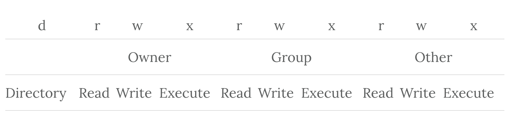
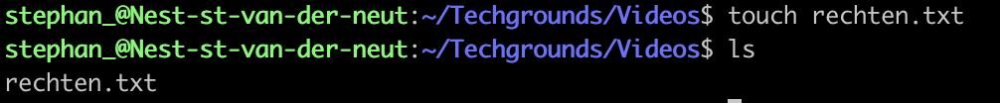
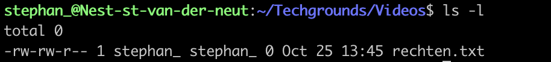
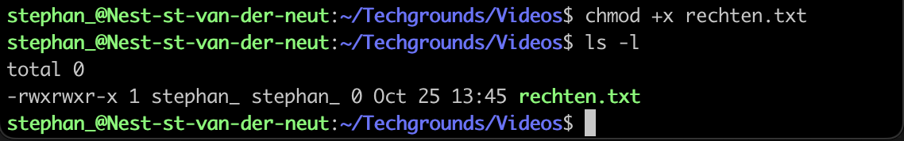
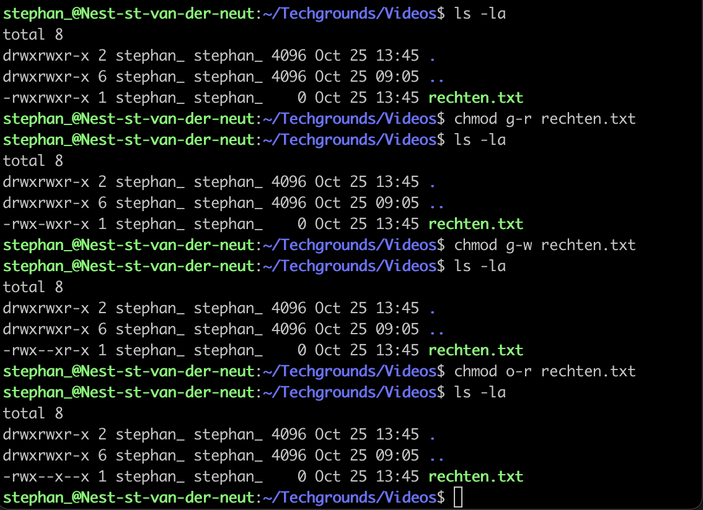
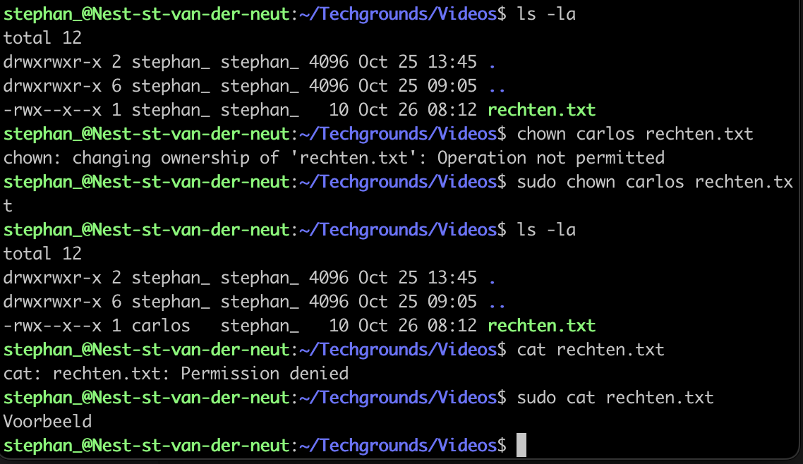
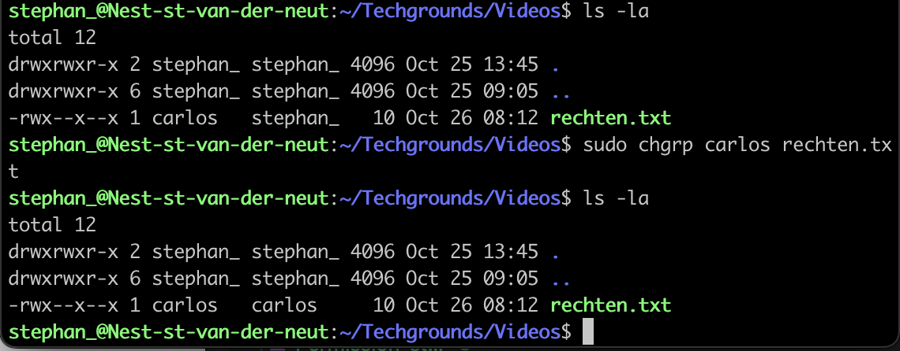

# File Permissions

## Key-terms
- permissions
  * reading permissions
  * writing permissions
  * Executing files (rwx) permissions
- permissions entities
  * Owner of the file
  * A Group
  * Everyone else
      
        

---
## Opdracht

>Bij deze opdracht maken we een tekst bestand aan. We kijken naar wie toegang heeft tot de app en wie welke bevoegheden heeft. Vervolgens maken we het bestand uitvoerbaar door ***execute permission (x)*** er aan toe te voegen.
>
>We gaan ook de ***read & write permissions(rw)*** verwijderen.
>
>Vervolgens gaan we een nieuwe eigenaar van het bestand aanwijzen waarbij ik zelf geen toegang meer heb tot het bestand tenzij ik de sudo command gebruik.
>
>Tenslotte gaan wij de ***Group Ownership*** aanpassen naar een andere groep.
----

### Bronnen
[Elated.com](https://www.elated.com/understanding-permissions/)

[Seismic Rocks,LLC](https://www.youtube.com/watch?v=zDT9HH6dKpQ)

[Akamai Developer](https://www.youtube.com/watch?v=ngJG6Ix5FR4)

[linuxize.com](https://linuxize.com/post/linux-chown-command/#google_vignette)

[docs.oracle.com](https://docs.oracle.com/cd/E19683-01/816-4883/6mb2joat3/index.html)

---

### Ervaren problemen

Er zijn geen problemen geweest bij dit onderdeel

----

### Resultaat

Het aanmaken van een text file
 

Hier kan je zien wat de ***File Permissions*** zijn. De eigenaar en de groep hebben de Read & Write permissie en de rest heeft alleen de Read permissie  

Hier is de ***execute persmission (x)*** toegevoegd aan de Owner, Group en Other

De ***Read & Write Persmissions*** zijn weggehaald bij de Group en Others. In dit voorbeeld zie je dat het er per regel 1 permissie is ontnomen. Dat kan beter door het te combineren door bijvoorbeeld ***chmod g-rx,o+rx rechten.txt***

De ***Ownership*** van het bestand *rechten.txt* is gewijzigd naar een andere gebruiker namelijk *carlos*. Ik kan het bestand in de eerste instantie niet lezen tenzij is de sudo command gebruik.

In het voorbeeld zie je dat carlos de ***Owner*** is van het bestand *rechten.txt* en dat de ***Group Ownership*** van de groep *stephan_* is. Dit is doormiddel van de *sudo chgrp* gewijzigd naar de groep carlos
 