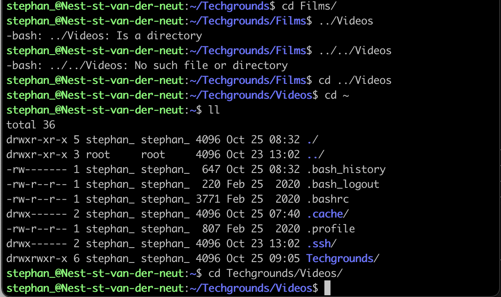

# Files & Directories

## Key-terms
- Files
- Folders
- Directories
- Path
---
## Opdrachten
>Hier moet worden uitgevogeld in welke directory ik zit. Hoe ik een lijst kan laten zien met alle files & directories. Daarnaast een nieuw directory aanmaken met een file erin en die file moet ook tekst bevatten.

---
### Bronnen

[link](https://www.google.com/search?q=Find+out+your+current+working+directory.&oq=Find+out+your+current+working+directory.&gs_lcrp=EgZjaHJvbWUyBggAEEUYOdIBBzE1NmowajeoAgCwAgA&sourceid=chrome&ie=UTF-8) Wits University

[link](https://www.youtube.com/watch?v=zf9ICoK-ZiI) ProgrammingKnowledge2

[link](https://www.youtube.com/watch?v=5_bfH0t8QfA) john partridge

---
### Ervaren Problemen

Ik ben te lang blijven hangen in het zoeken naar de Relative Path
___

### Resulaten

Hier laat ik zien in welke directory ik me bevind

   
Hier kan je een lijst zien met alle files en directories

   
De directory *techgrounds* is aangemaakt

   
In de directory is *techgrounds* is bestand gemaakt genaam *File.txt* met woorden *Hello World*

   

Hier beweeg ik door de directories heen met behulp van de *absolute & relative paths*.
   
   

