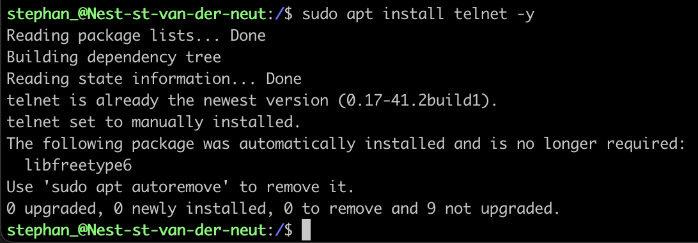
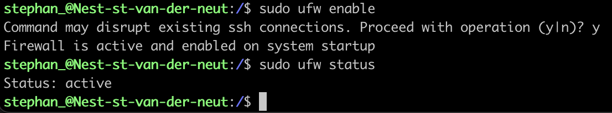

# Processes

## Key-terms
- Processes in Linux
  * Daemons
  * Services
  * Programs
- Active & Non-interactive
- SSH (secure Shell) 
- Telnet
- PID (Process ID)

---
## Opdracht
>In deze opdracht gaan we de telnet daemon opstarten, uitvogelen wat de PID is van de telnet daemon, uitzoeken hoeveel geheugen het gebruikt en het proces stoppen
> 
---

### Bronnen
[Krishnavik](https://www.youtube.com/watch?v=BW1jYDZYXps)

[Cyberciti.biz](https://www.cyberciti.biz/faq/show-all-running-processes-in-linux/)

---

### Ervaren problemen

De VM stopte ermee en ik had geen toegang meer

---

### resultaat

Hier heb ik de telnet daemon geinstalleerd
 

Het PID nummer van de *Telnet Daemon* is 5620 en het gebruikt geen geheugen op dit moment

