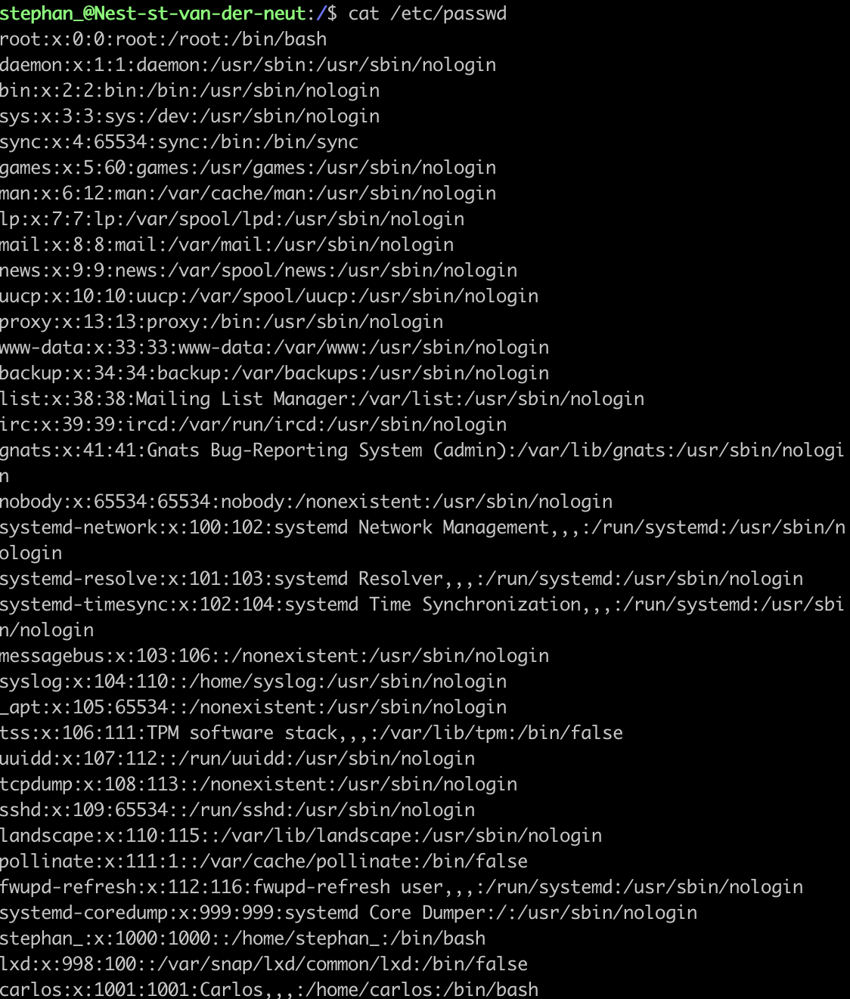

# Users & Groups

## Key-terms
- Root
- Sudo
___

## opdrachten
>Bij dit onderdeel moet een nieuwe User aangemaakt worden in de VM. De nieuwe User moet onderdeel zijn van de Admin Group, moet een wachtwoord hebben en gebruik kunnen maken van de Sudo command.
>Daarnaast moet we de files vinden waar de Users, Passwords en Groups staan
___
### Bronnen

[Cyberciti](https://www.cyberciti.biz/faq/how-to-create-a-sudo-user-on-ubuntu-linux-server/)

[Stackpath](https://support.stackpath.com/hc/en-us/articles/360025308732-Add-Users-to-a-Virtual-Machine)

[Akamai Developer](https://www.youtube.com/watch?v=b-9j2jiCOEA)

---

### Ervaren problemen
Er zijn geen problemen geweest bij dit onderdeel

---

### Resultaten

Hier kan je zien dat de user carlos is aangemaakt
   
De user carlos in nu onderdeel van de admin group
  
De user carlos heeft ook een wachtwoord

De user carlos kan nu ook de sudo command gebruiken
  
De suer carlos is te vinden in de bestanden waar de gebruikers, wachtwoorden en groepen worden opgeslagen
   

