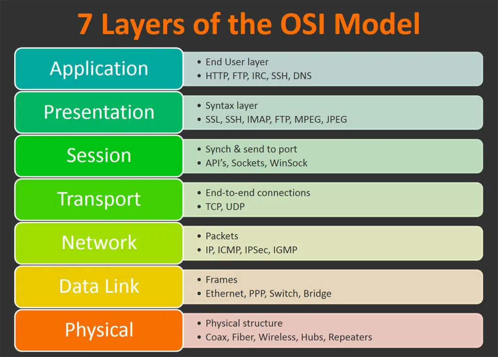

# OSI Stack

## Key-terms
- Open Systemes Interconnection Model (OSI model)
- TCP/IP model
- Layers

  
---
## Opdrachten
>bestudeer het OSI Model & TCP/IP Model
---

### Bronnen
[Cloudflare.com](https://www.cloudflare.com/learning/ddos/glossary/open-systems-interconnection-model-osi/)

[NetworkChuck](https://www.youtube.com/watch?v=CRdL1PcherM)

---

### Ervaren Problemen

Er zijn geen problemen geweest bij dit onderdeel

---
### Resultaat

