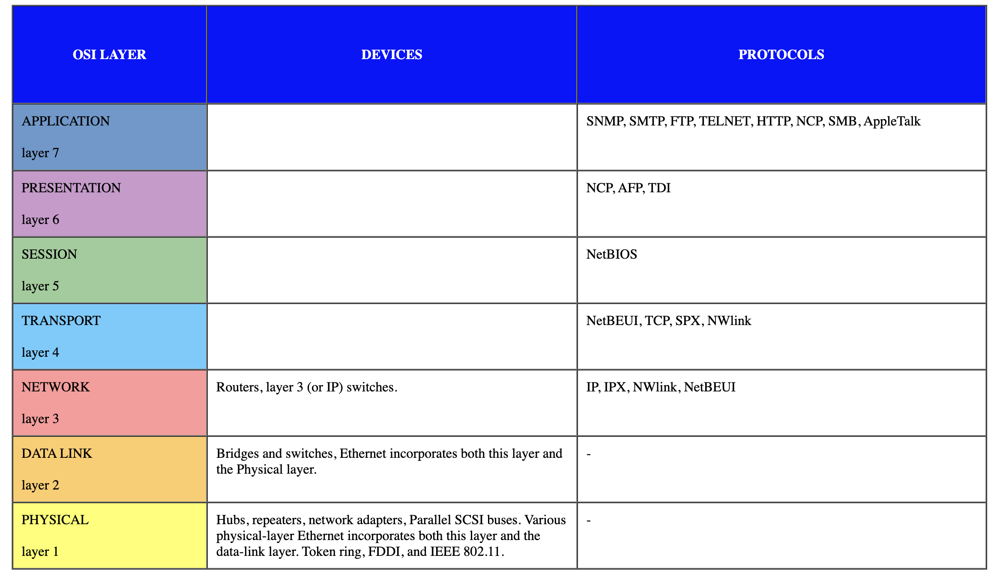
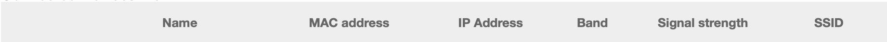

# Networking Devices

## Key-terms
- Router
- Switch
- Repeaters
- Access point
- Routing
- Gateways
- DHCP server
---
## Opdrachten
>- We gaan de veel vookomende netwerkapparatuur benoemen en de functie omschrijven
>- Het vinden van een lijst van mijn eigen aangesloten apparaten
>- laten zien waar de DHCP server staat op mijn netwerk
---

### Bronnen
[Wikibooks.org](https://nl.wikibooks.org/wiki/Netwerkapparatuur)

[ByteByteGo](https://www.youtube.com/watch?v=0y6FtKsg6J4)

[NordVPN.com](https://nordvpn.com/nl/blog/wat-is-dhcp/)

---

### Ervaren Problemen

Ik kon niet inloggen in mijn router, ook niet nadat ik de router had gereset. Het probleem lag mogelijk aan Google Chrome aangezien ik wel op mijn mobiel kon inloggen en dat het wel mogelijk was met de browser Safari.

---
### Resultaat

Een lijst van veel voorkomende netwerkapparatuur en hun functies

***Repeater*** - een fysiek netwerkverbindingsapparaat. Zijn functie is om signalen opnieuw te genereren (dat wil zeggen versterking en omvorming van het originele signaal).
***Hub*** - De hoofdfunctie is om het ontvangen signaal te regenereren om de transmissieafstand van het netwerk te vergroten. 
***Network Bridge*** - Een netwerkbrug verbindt twee afzonderlijke netwerken op het datalinkniveau en laat gegevens tussen hen doorstromen.
***Switch*** - Een switch is een apparaat dat gegevenspakketen binnen een lokaal netwerk efficient door stuurt naar specifieke apparaten
***Router*** - Een router is een centraal netwerkapparaat dat gegevenspakketen tussen verschillende netwerken verdeelt en beheer. Het verbind het lokale netwerk met andere netwerken.

Er wordt ook gevraagd welke informatie zichtbaar is van mijn verbonden apparaten op mijn router.

Je kunt de naam van de apparaten vinden met hun ***MAC Adres*** en ***IP adres***. De ***Band*** vertelt hoeveel data kan worden getransporteerd in een bepaalde tijdseenheid.
De ***signal strength*** geeft aan hoe krachtig het signaal is, hoe sterker het signaal hoe stabieler de internetverbinding. Een ***SSID*** staat voor Service Set Identifier. Dit is de naam van het draadloosnetwerk waar de apparaten mee verbonden zijn.

Mijn DHCP server kan ik bij de LAN-instellingen vinden. Mijn IP bereik heeft een bereik van 200 nummers. De lease periode kan worden ingesteld en ook welk IP adres mijn apparaten toegewezen kunnen worden.