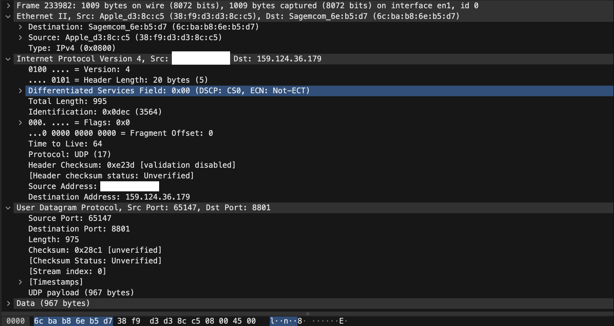
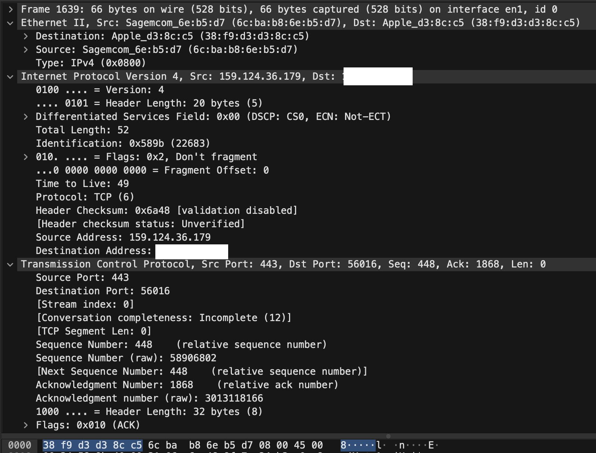

# Protocols

## Key-terms
- TCP
- UDP
- Three-way Handshake

---
## Opdrachten
> Noem een protcol voor elke laag van het OSI Model
>
> Uitzoeken wie bepaalt welke protocollen worden gebruikt
>
> In wireshark kijken naar mijn netwerk data

---

### Bronnen

[Geeksforgeeks.org](https://www.geeksforgeeks.org/presentation-layer-in-osi-model/)

[Beckhoff.com](https://infosys.beckhoff.com/english.php?content=../content/1033/tf6310_tc3_tcpip/84246923.html&id=)

---

### Ervaren Problemen

Er zijn geen problemen geweest bij dit onderdeel

---
### Resultaat

Protocollen per OSI Layer van 7 naar 1.

- 7 Application Layer
    * HTTP (Hypertext Transfer Protocol)
    * FTP (File Transfer Protocol )
    * DNS (Domain Name System)
    * SNMP (Simple Network Management Protocol)
    * Telnet
- 6 Presentation Layer
    * SSL (Secure Sockets Layer)
    * TLS (Transport Layer Security)
    * Mediaformaten
- 5 Session Layer
    * NetBIOS
    * PPTP
- 4 Transport Layer
    * TCP (Transmission Control Protocol)
    * UDP (User Datagram Protocol)
- 3 Network Layer
    * IP (Internet Protocol)
    * ICMP (Internet Control Message Protocol)
- 2 Data Link Layer
    * PPP (Point-to-Point Protocol)
    * ATM (Asynchronous Transfer Mode)
    * Ethernet
- Physical Layer
    * Ethernet
    * USB
    * Bluetooth
    * WiFi (IEEE 802.11)

---
Hier kan je zien welke protocollen worden gebruik en wie dat bepaalt

Op de fysieke laag wordt het bepaalt door een Industry Standards Organization en nieuwe technologische ontwikkelingen

De Datalink Laag wordt bepaald door de IEEE (Institute of Electrical and Electronics Engineers) en de IETF (Internet Engineering Task Force)

De Netwek Laag wordt ook bepaald door de IETF

De Transport Laag wordt ook bepaald door de IETF

De Sessie, Presentatie en Toepassings Laag is afhankelijk van de behoefte van de toepassing en gebruikte software. Ook hang het af compatibiliteit, prestaties, beveiliging en toepassingsvereisten. Netwerk architecten en beheerders werken samen met standaardisatieorganisaties en brancheorganisaties over welke protocollen het best aansluiten

---

Via wireshark is het mogelijk om je netwerk data te zien, hier kan je een voorbeeld zien van een UDP Protocol.

en hier is een voorbeeld van een TCP Protocol.

