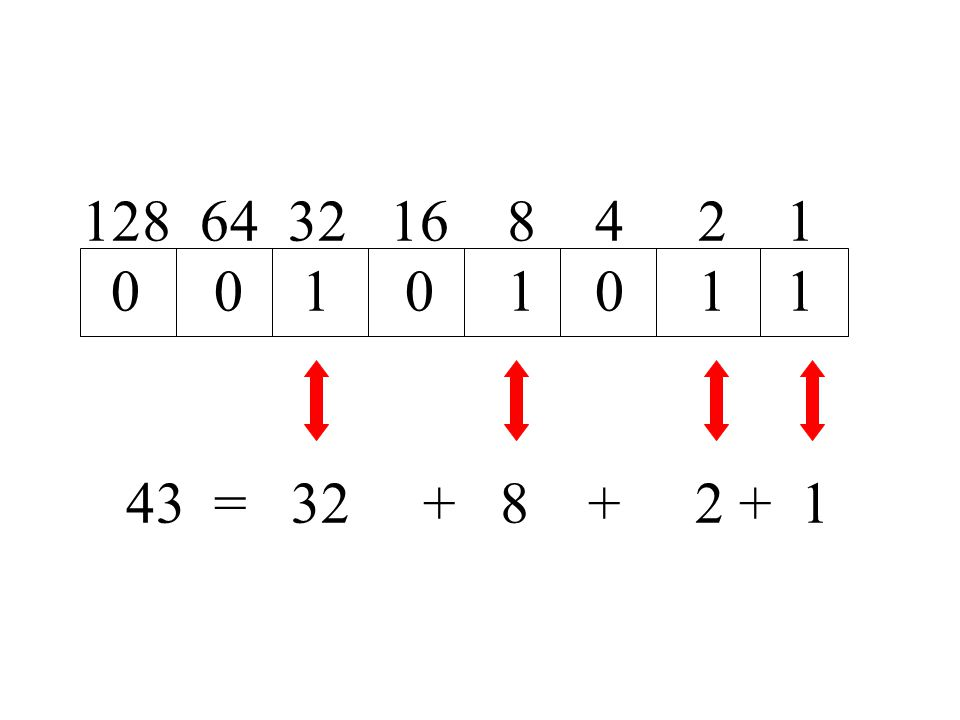
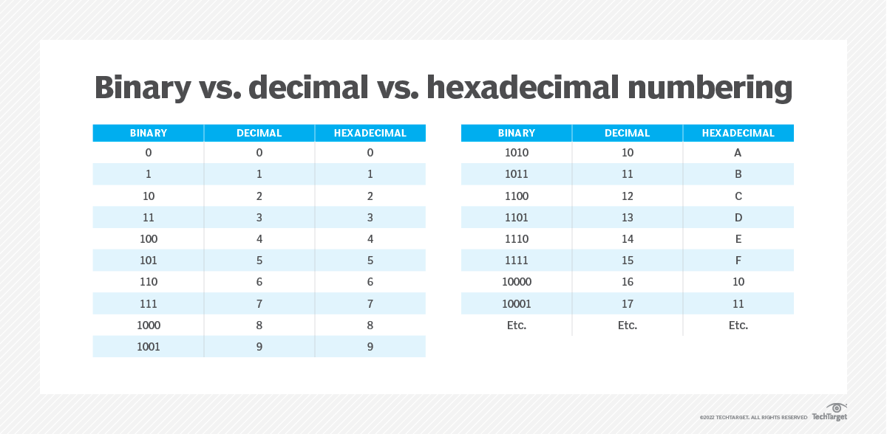

# Counting in Binary and Hex

## Key-terms
- Binary
- Hexadecimal
- Bits (1010 heeft 4 getallen en daardoor 4 Bits)
- Bytes (8 Bits bij elkaar is 1 Byte)
  
---
## Opdrachten
> We gaan getallen omzetten naar Binary en Hex en vice verca
---

### Bronnen
[Fireship](https://www.youtube.com/watch?v=zDNaUi2cjv4)

[The Organic Chemistry Tutor](https://www.youtube.com/watch?v=rsxT4FfRBaM)

[Neso Academy](https://www.youtube.com/watch?v=WGN4NWICTpQ)

---

### Ervaren Problemen

Er zijn geen problemen geweest bij dit onderdeel.

---
### Resultaat

| Decimal           | Binary            |
|--- |--- |
| 16                | 0001 0000         |
| 128               | 1000 0000         |
| 228               | 1110 0100         |
| 112               | 0111 0000         |
| 73                | 0100 1001         |

| Binary            | Decimal           |
|--- | --- |               
| 1010 1010         | 170               |            
| 1111 0000         | 240               |       
| 1101 1011         | 219               |       
| 1010 0000         | 160               |       
| 0011 1010         | 58                |       

| Decimal           |Hex|
|---                |---|
| 15                | F                 |
| 37                | 25                |
| 246               | F6                |
| 125               | 7D                |
| 209               | D1                |
