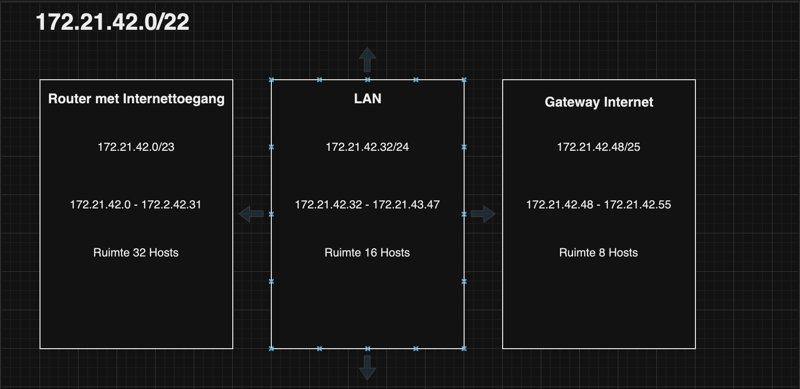

# Subnetting

## Key-terms
- Subnet mask
- Prefix
- CIDR notation (Classless Intern Domain Routing)
---
## Opdrachten
>Er moet een netwerkarchitectuur worden gemaakt met de volgende eisen.
>1. subnet dat alleen van binnen het LAN bereikbaar is. Dit subnet moet minimaal 15 hosts kunnen plaatsen.
>2. subnet dat internet toegang heeft via een router met NAT-functionaliteit. Dit subnet moet minimaal 30 hosts kunnen plaatsen (de 30 hosts is exclusief de router).
>3. subnet met een network gateway naar het internet. Dit subnet moet minimaal 5 hosts kunnen plaatsen (de 5 hosts is exclusief de internet gateway).

---

### Bronnen

[NetworkChuck](https://www.youtube.com/watch?v=OD2vG5st4zI)

---

### Ervaren Problemen

Er zijn geen problemen geweest bij dit onderdeel.

---
### Resultaat

Voor de opdracht moesten er 3 subnets worden aangemaakt. In mijn bron werd verteld dat je het best kan beginnen met de grootste groep en dat was groep met internettoegang dat moest bestaan uit 30 Hosts + router. De volgende groep was de LAN groep dat moest bestaan uit minimaal 15 Hosts. En de Gateway moest bestaan uit 5 Hosts + de internet Gatway.

Ik heb voor de Groep met internettoegang ruimte gereserveerd met 32 plekken omdat we er 31 nodig hebben. Voor de LAN groep heb ik 16 plekken gereserveer omdat we er 15 nodig hebben. Voor de Gateway hebben we 8 plekken gereserveerd omdat we er maar 6 nodig hebben

