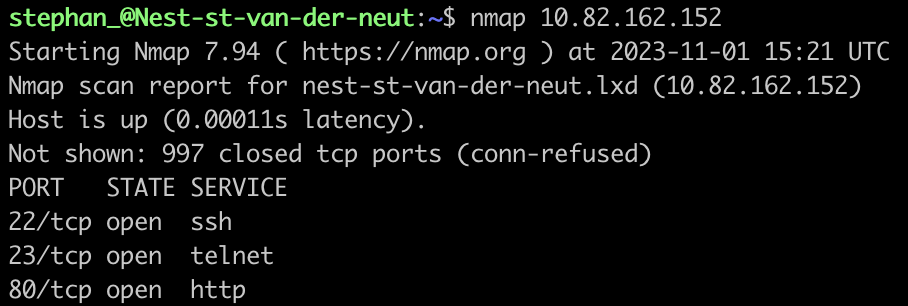
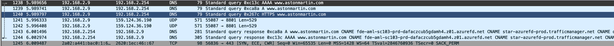

# Network Detection

## Key-terms

- Nmap (Network Mapper)

---
## Opdrachten
>Gebruik de Nmap commando om mijn linux machine te scanne.
>
>Gebruik Wireshark om te zien wat er gebeurt als je naar een website gaat.
---

### Bronnen

[Learn Linux Tv](https://www.youtube.com/watch?v=5tzp9QzwnUQ)

[Networking Academy](https://www.youtube.com/watch?v=uGysc4upuX0)

---

### Ervaren Problemen

Er zijn geen problemen geweest bij dit onderdeel.

---
### Resultaat

Nadat ik Nmap had geinstalleerd heb ik de command ook gebruikt om de informatie te zien over mijn netwerk.

Hier kan je zien dat ik naar de wesbite van Aston Martin ben gegaan
