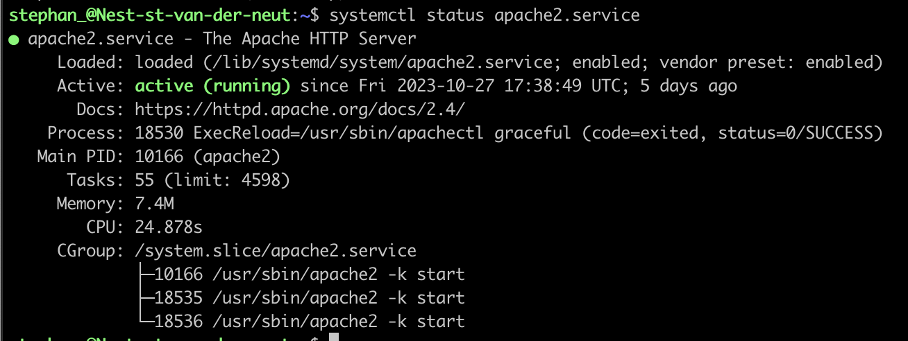
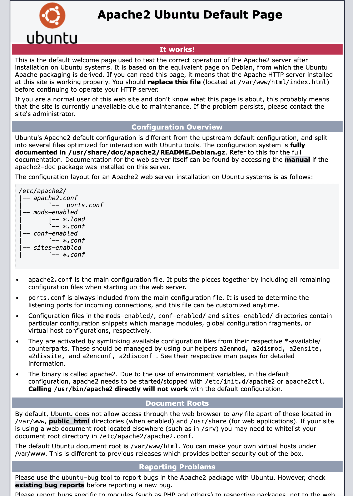
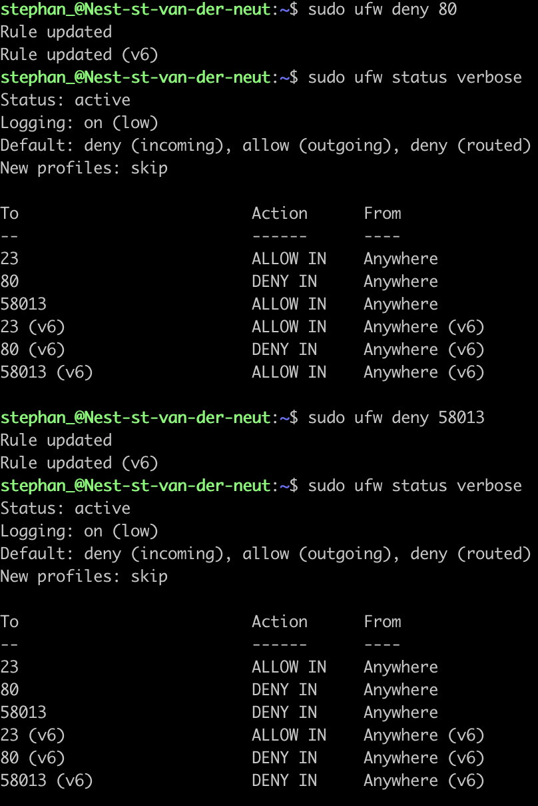
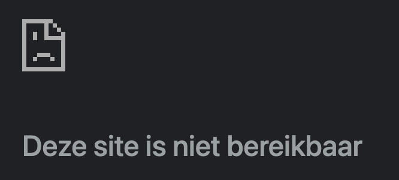

# Firewalls

## Key-terms
- Stateful Firewall
- Stateless Firewall
  
  
---
## Opdrachten
>Het is de bedoeling om een webserver op te starten op mijn VM om het daarna te bezoeken via mijn eigen computer. Vervolgens moet er doormiddel van een Firewall de toegang tot de website worden geblokkerd.

---

### Bronnen

[LearnCantrill](https://www.youtube.com/watch?v=rL4-vbsN35w)

[Techterms](https://www.youtube.com/watch?v=fCM86XAyQ7o)

[Abstract Programmer](https://www.youtube.com/watch?v=PZAT0tIwYh4)

---

### Ervaren Problemen

Ik had moeite met het zoeken naar het IP adres en het poortnummer. In de bronnen lijkt het heel makkelijk. Echter had ik de opdracht beter moeten lezen want er staat dat ik mijn uniek poortnummer moet gebruiken uit het gedeelde Google Drive bestand waarin ook het publieke IP adres staat. Dus IP adres:Unieke poortnummer moet het zijn.

---
### Resultaat

Hier is te zien dat de Apache server actief is.

Hier kan je zien dat de Apache webserver werkt. Ik heb het publieke IP adres gebruikt plus mijn unieke poortnummer om de pagina te openen. Omdat de opdracht openbaar komt te staan zal ik het IP adres en poortnummer niet noemen.

De Firewall heb ik aangezet voor 2 poorten en je kan de status ervan inzien

Hier kan je zien wat er gebeurt zodra de poorten geen toegang meer geven.

