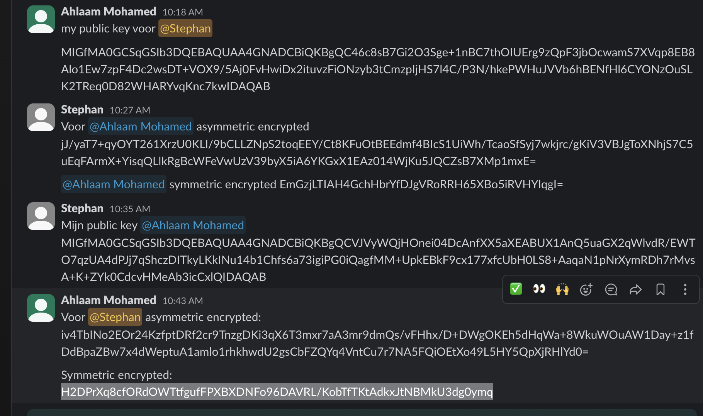
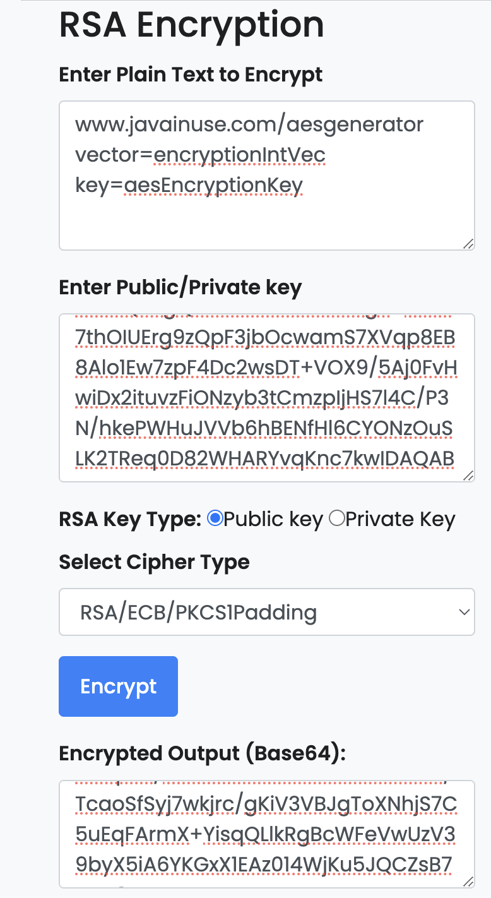
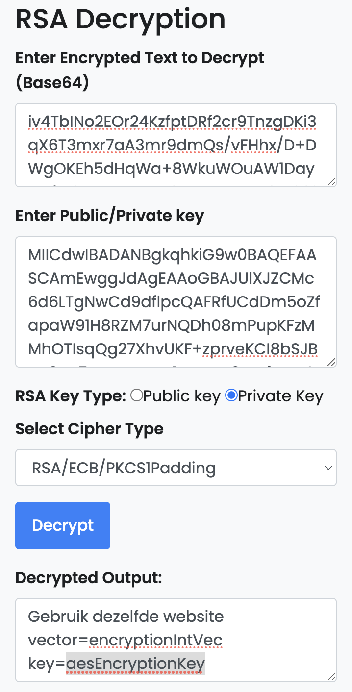
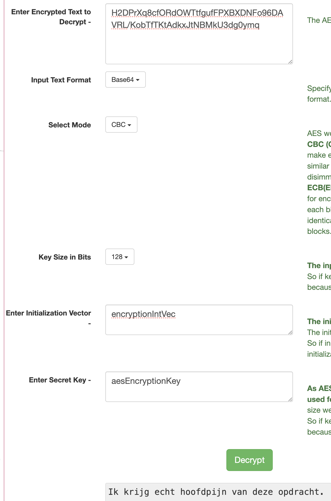

# Symmetric Encryption

## Key-terms
- Encryption
- Ciphers
- Ceasar Cipher
- Cryptography
  
---
## Opdrachten
>Opzoeken van andere Ciphers naast de Ceasar Cipher en zoeken naar 2 digitale Ciphers die vandaag de dag worden gebruikt.
>
>Daarnaast moet er een bericht worden verstuurd met symmetric encription zonder dat de klasgenoten kunnen ontsleutelen wat er in mijn bericht staat

---

### Bronnen

[Khan Academy](https://www.youtube.com/watch?v=sMOZf4GN3oc)

[interestingengineering.com](https://interestingengineering.com/innovation/11-cryptographic-methods-that-marked-history-from-the-caesar-cipher-to-enigma-code-and-beyond)

[Udacity](https://www.youtube.com/watch?v=SkJcmCaHqS0) 

[OCLPhase2](https://www.youtube.com/watch?v=Y_E0M5vfw3g)

[Udacity](https://www.youtube.com/watch?v=WLm5_cxeywY)

[RSA Conference](https://www.youtube.com/watch?v=b57zGAkNKIc)

[Javainuse](https://www.javainuse.com/aesgenerator)

---

### Ervaren Problemen

Het was de bedoeling dat je eerst de opdracht maakt bij Asymmetric encription om vervolgens Symmetric encryption te doen. Dat bleek ook wel zo te zijn vanwege dat de symmetric key naar een klasgenoot moest zonder dat de rest het zag. De Symmetric key is toen Assymetrische versleuteld.

---
### Resultaat

Hier zijn een aantal vormen van ciphers

1. The Steganography Hiding Messages in Plain Sight
2. Vigenere Cipher
3. Transposition cipher

Hier zijn 2 vormen van digitale ciphers die vandaag de dag worden gebruikt.

1. Advanced Encryption Standard
2. RSA (Rivest-Shamir-Adleman)

Er moet een symmetrisch versleuteld bericht worden gestuurd naar Ahlaam via de Slack Kanaal van onze klas. De key moet worden gedeeld zonder dat de rest het kan zien. Ik heb daarom gekozen om de key te versturen in een assymentrische versteuteld bericht. Daarnaast heeft Ahlaam mij ook een bericht gestuurd op deze manier.

Hier kan je mijn bericht zien dat ik heb omgezet naar een symmetrisch versleuteld bericht.

Met Ahlaam heb ik de nodige gegevens uitgedeeld. Ten eerste had ik haar public key nodig om een assymetrisch bericht te sturen waarin de keys staan en hoe de symmetrische key te openen. Ze heeft dit ook voor mijn gedaan.

Hier kan je zien wat er in de asymmetrische tekst is gezet.
Ik heb de website doorgegeven waar de versleutelde tekst kan worden ontsleuteld + de vector en de key.

Ahlaam heeft mij ook een assymetrisch bericht gestuurd die ik heb ontsleuteld. Hier staat welke website ik moet gebruiken + de vector en Key.

Met de gegevens uit het asymmetrisch bericht kan ik het symmetrisch bericht openen. Het bericht was "Ik krijg hoofdpijn van deze opdracht"

Het nadeel van symmetric encription is dat iedereen met de key het bestand kan openen. Bij deze opdracht heb ik ervoor gekozen om de key van de symmetric encription te laten versleutel met een assymetrische encription zodat er maar 1 persoon aan kon komen. Dit is dan een stap veiliger maar onnodig werk als je weet dat het met assymmetric encryption ook veilig is.
