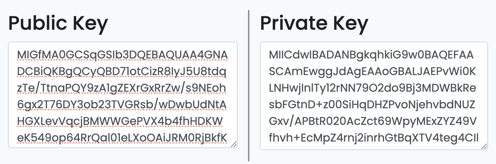
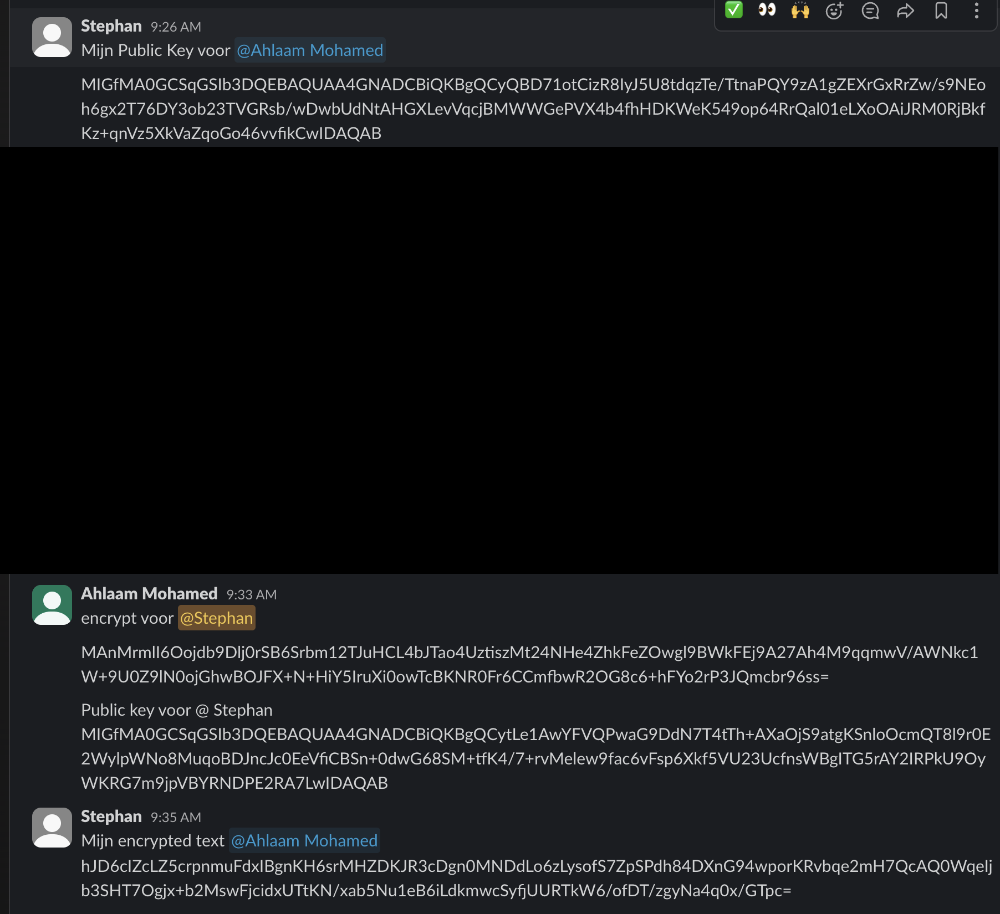
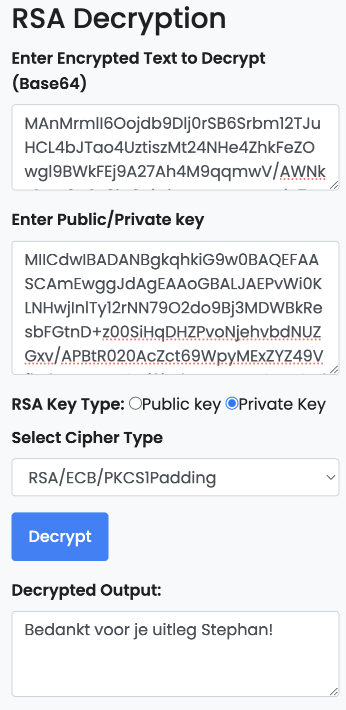

# Asymmetric Encryption

## Key-terms
---
## Opdrachten

Er moet een key pair aan worden gemaakt en daarnaast is het de bedoeling dat je een versleuteld bericht naar een klasgenoot stuurt.

---

### Bronnen

[Data Slayer](https://www.youtube.com/watch?v=GZNobm3qNaE)

[Devlan.com](https://www.devglan.com/online-tools/rsa-encryption-decryption)

---

### Ervaren Problemen

In de opdracht staan een link om een bericht te versleutelen. Die link heeft me op het verkeerde been gezet waardoor ik de opdracht absoluut niet begreep. Ik heb er meer dan 4 uur aan gezeten zonder maar ook iets vooruit te komen. Met de website van devlan.com zag ik op een gegeven moment wel hoe het moest. 

---
### Resultaat

Hier in een Key-pair aangemaakt.

Ik heb mijn Public key met Ahlaam gedeeld. Zij heeft met mijn Public key haar bericht versleuteld en dat naar mij gestuurd zodat ik het kan ontsleutelen, daarnaast heeft ze haar Public met mij gedeeld zodat ik ook een bericht kon versleutelen zodat zij het bericht kan ontsleutelen.

Met mijn private key en het versleuteld bericht heb ik de tekst weten te ontsleutelen.

