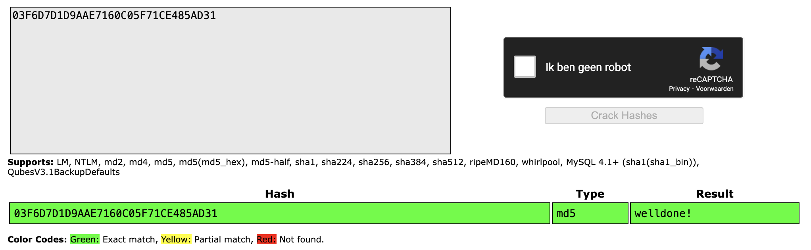
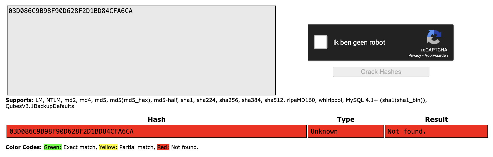
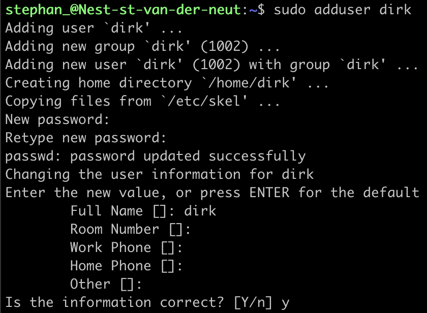
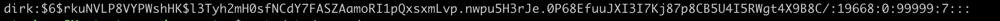
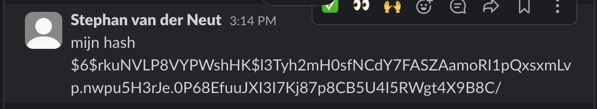
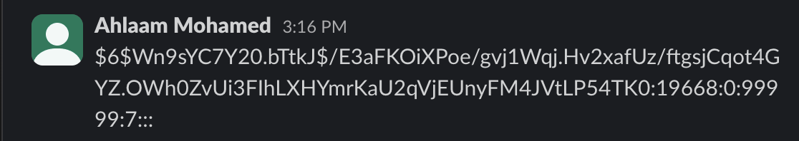

# Passwords

## Key-terms
- Salting
- Hash
- Rainbow Table

---
## Opdrachten
>Bij de opdracht moet worden uitgezocht waarom de voorkeur uitgaat naar Hashing boven symmetric encryption voor het opslaan van wachtwoorden.
>
>Er moet worden uitgezocht hoe de Rainbow Table gebruikt kan worden om wachtwoorden te kraken en 2 hashes door de Rainbow Table halen.
>
>Er moet ook een nieuw user worden aangemaakt in Linux met hetzelde wachtwoord dat mijn klasgenoten hebben. De wachtwoord Hashes moet worden vergeleken met die van mijn klasgenoten.
---

### Bronnen

[Programming w/ Professor Sluiter](https://www.youtube.com/watch?v=GI790E1JMgw)

[NetworkChuck](https://www.youtube.com/watch?v=z4_oqTZJqCo)

[Network World](https://www.networkworld.com/article/3629440/how-password-hashing-works-on-your-linux-system.html)

---

### Ervaren Problemen

Er zijn geen problemen geweest bij dit onderdeel.

---
### Resultaat

Hashing is een manier om wachtwoorden veilig op te slaan. Bij hashing wordt het wachtwoord omgezet in een unieke, onomkeerbare code. Als de code wordt gestolen, kan het oorspronkelijke wachtwoord niet worden achterhaald. 
Symmetrische encryptie kan dit niet bieden en is ook trager. Bovendien kunnen we salting toevoegen voor extra beveiliging, wat betekent dat zelfs als twee mensen hetzelfde wachtwoord hebben, de opgeslagen codes verschillend zijn. Kortom, hashing is snel, veilig en efficiënt voor het beschermen van wachtwoorden.

Een rainbow table is een vooraf gemaakte tabel met gehashte wachtwoorden en hun oorspronkelijke tekstwaarden. Aanvallers kunnen het gebruiken om snel gehashte wachtwoorden te kraken. Dit werkt alleen als wachtwoorden niet  "salted" zijn wat betekent dat een unieke waarde aan elk wachtwoord is toegevoegd voordat het wordt gehasht. Gebruik van salting en sterke hashfuncties voorkomt effectief dit soort aanvallen.

De onderstaande hash moest door de rainbow generator worden gehaald:
03F6D7D1D9AAE7160C05F71CE485AD31.
De hash kon worden ontcijferd, er staat welldone!

Deze onderstaande hash moest ook door de rainbow generator worden gehaald:
03D086C9B98F90D628F2D1BD84CFA6CA.
Deze hash was niet te kraken omdat het een string was van 16 verscchillende karakters.

Er werd gevraagd om een nieuwe user aan te maken en dat is dirk geworden met zijn wachtwoord.

De hash van dirk is hieronder te zien.

Er werd gevraagd om de hash te vergelijken en dat heb ik vergeleken met een user die Ahlaam had aangemaakt.
mijn user had de volgende hash.

De user van Ahlaam had deze hash.

