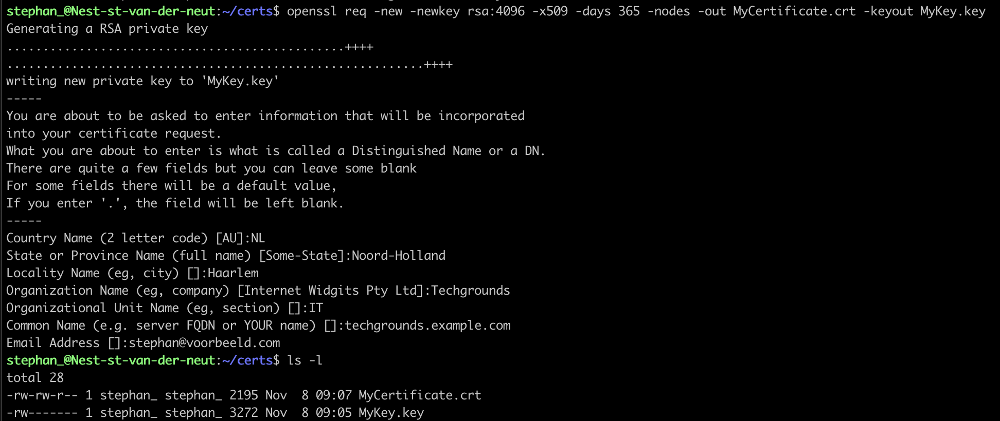
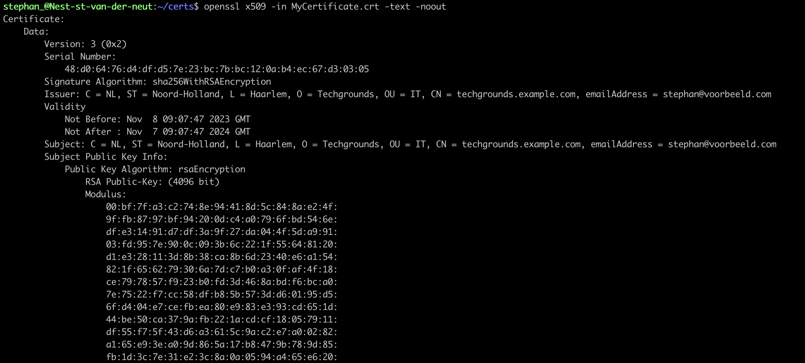
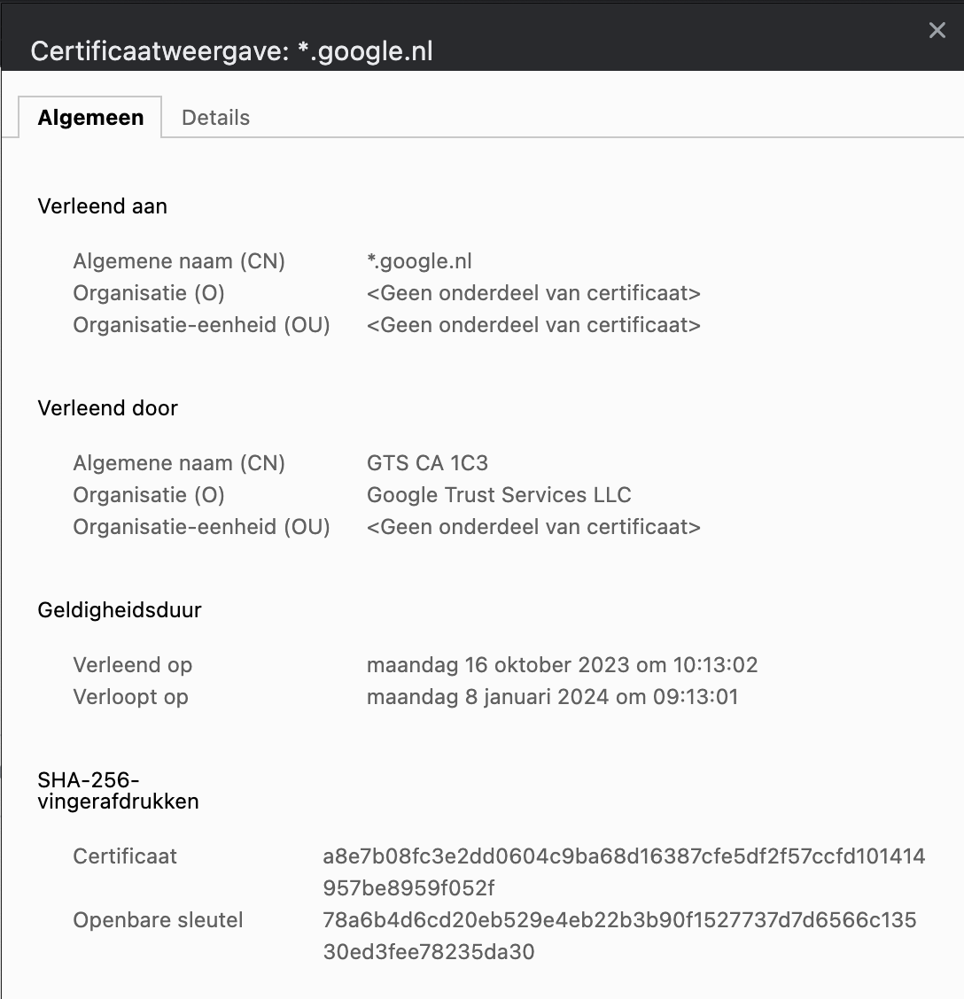
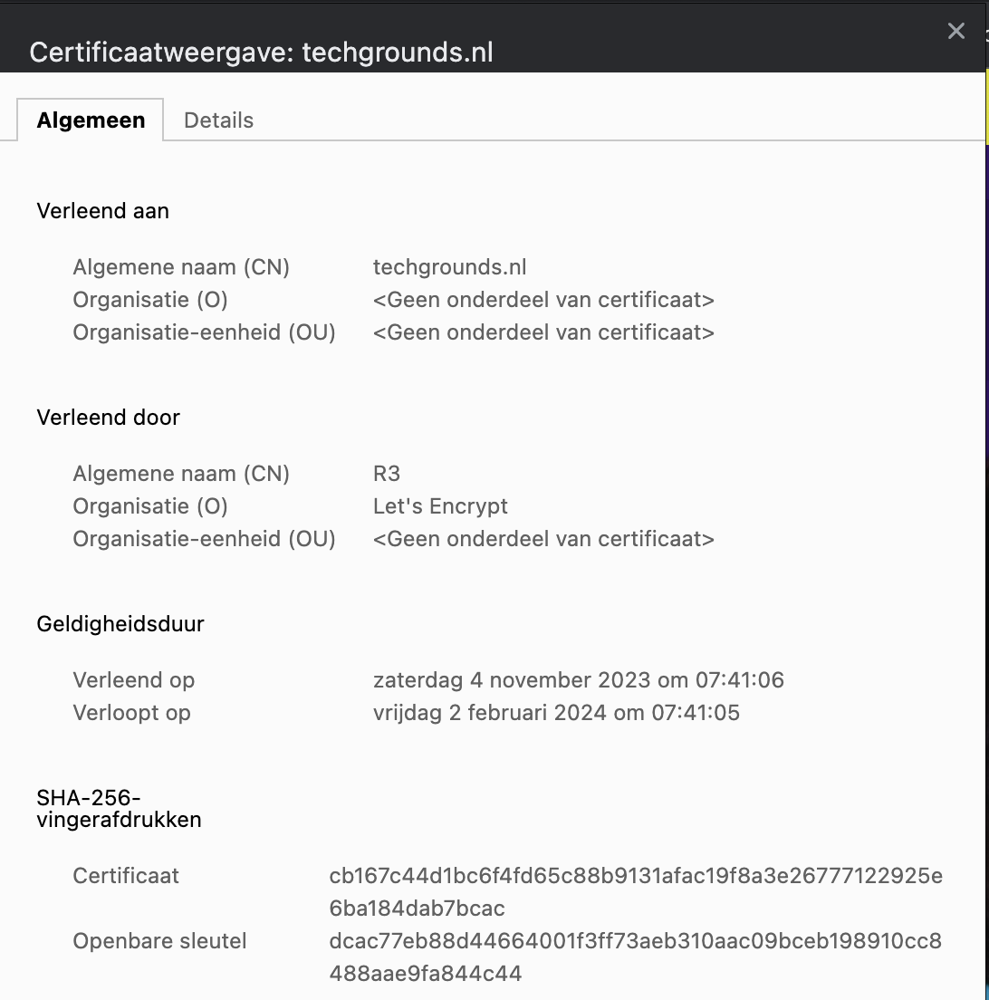
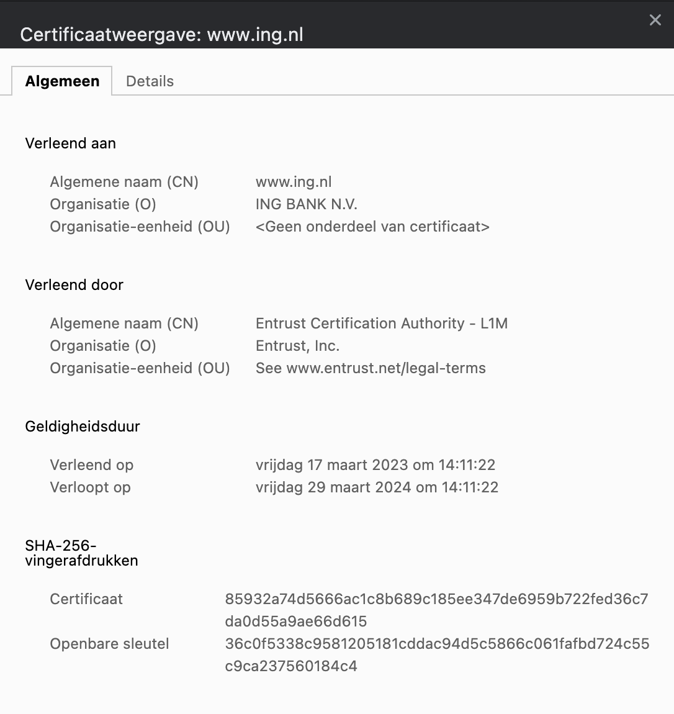
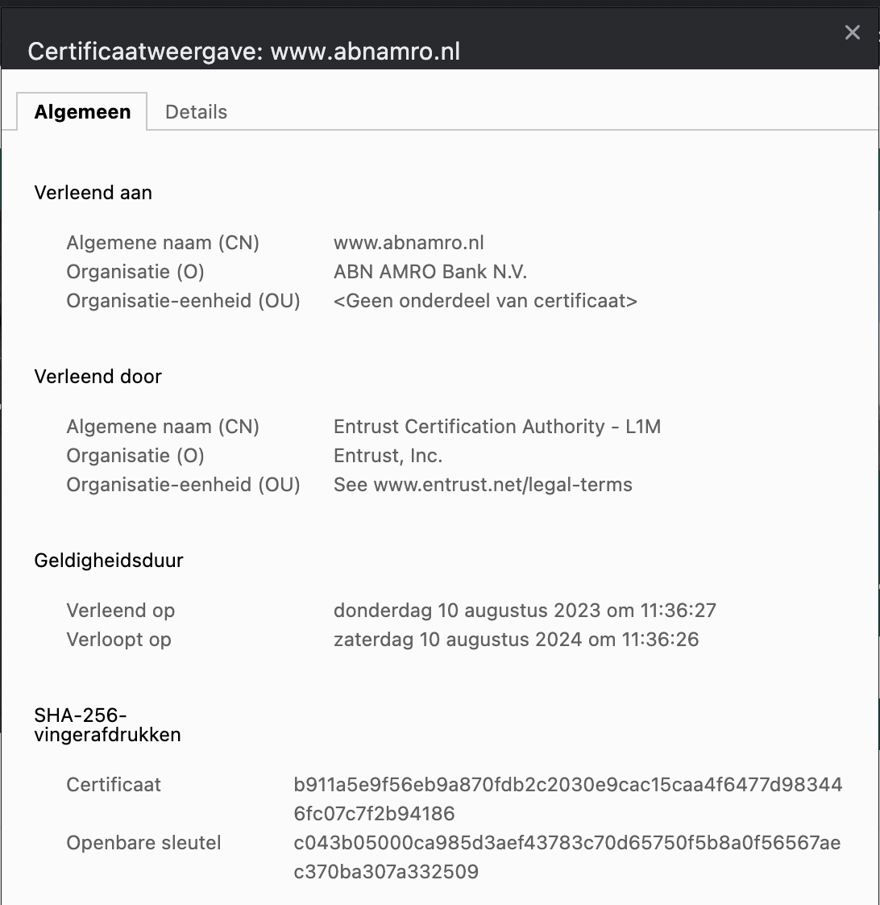
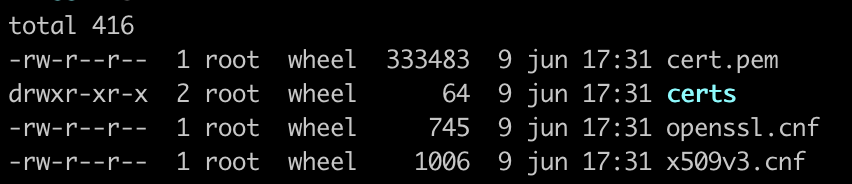
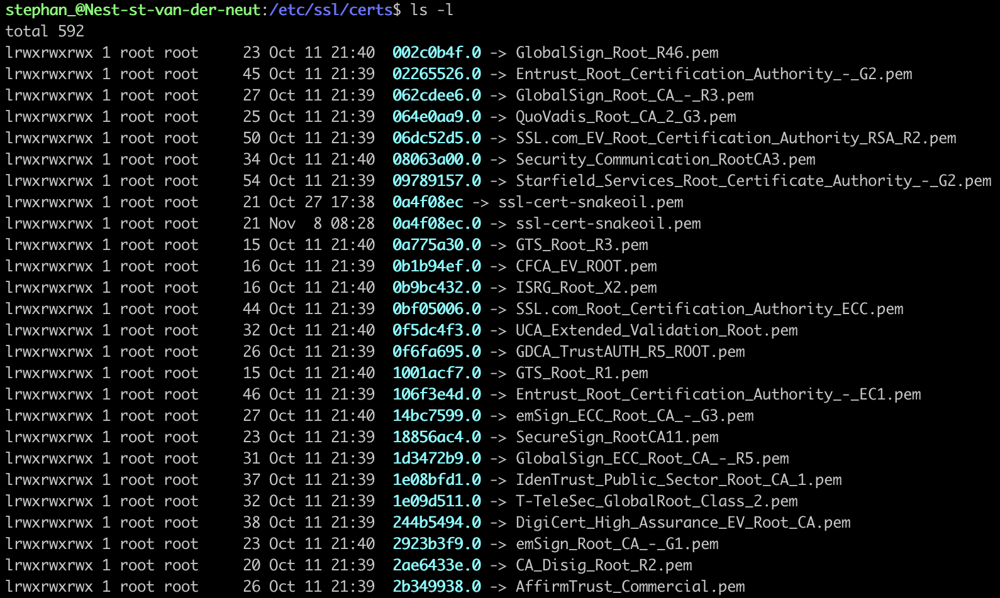

# Onderwerp

## Key-terms
- Public Key infrastructure (PKI)
- Digital certificates
- X.509
---
## Opdrachten
>In deze opdracht is het de bedoeling om een self-signed certificate te maken in mijn VM.
>
>Ook moet de certificaten van de volgende websites worden opgezocht: techgrounds.nl / google.nl / ing.nl.
>
>Verder wordt er gevraagd om de lijst van certificaten te vinden op mijn computer en VM.

---

### Bronnen

[IBM Technology](https://www.youtube.com/watch?v=0ctat6RBrFo)

[Delicious Brains](https://www.youtube.com/watch?v=SlcrTSvMioU)

[Akamai Developer](https://www.youtube.com/watch?v=Qg5ghpiEHm0)

[Linuxhandbook.com](https://linuxhandbook.com/check-certificate-openssl/)

---

### Ervaren Problemen

Er zijn geen problemen geweest bij dit onderdeel.

---
### Resultaat

Met de onderstaande command heb ik de cerificaat MyCertificate.crt aangemaakt met de key MyKey.key

Met de command hieronder check ik de status van mijn certificaat.

Er is ook gezocht naar de certificaten van websites.
Hier kan je het certificaat zien van Google.nl.

Dit is het certificaat van techgrounds.nl.

Dit is het certificaat van ING.nl.

Dit is het certificaat van abnamro.nl

Ik heb op mijn eigen computer niet veel kunnen vinden. Dit was wat ik kon vinden op mijn computer.

In mijn VM heb ik ook gezocht naar de certificaten en hier kwam wel een hele lijst uit.
