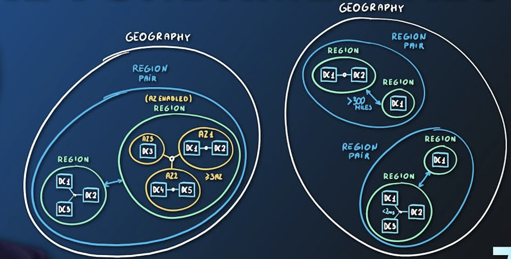
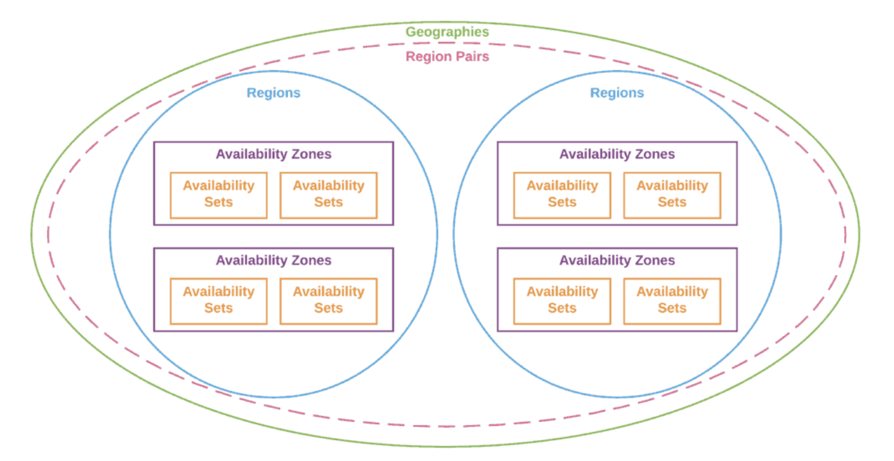

# Azure Global Infrastructure

## Key-terms
- Regions
- Availability Zones
- Region pairs
- 
---
## Opdrachten
>tekst
---

### Bronnen

[Adam Marczak - Azure for Everyone
](https://www.youtube.com/watch?v=C-nNw1mGwzE)

[Maczak.io](https://marczak.io/az-900/episode-07/cheat-sheet/)

---

### Ervaren Problemen

---
### Resultaat

**Azure data center**
- Physical facility
- Hosting for group of networked servers
- Own power, cooling & networking infrastructure

**Azure Region**
- Geographical area on the planet
- One but usually more datacenters connected with low-latency network (<2 milliseconds)
- Location for your services
- Some services are available only in certain regions
- Some services are global services, as such are not assigned/deployed in specific region
- Globally available with 50+ regions
- Special government regions (US DoD Central, US Gov Virginia, etc.)
- Special partnered regions (China East, China North)

**Azure Availability Zone**
- Regional feature
- Grouping of physically separate facilities
- Designed to protect from data center failures
- If zone goes down others continue working
- Two service categories
    - Zonal services (Virtual Machines, Disks, etc.)
    - Zone-redundant services (SQL, Storage, etc.)
- Not all regions are supported
- Supported region has three or more zones
- A zone is one or more data centers

**Azure Region Pair**
- Each Region is paired with another region making it a region pair
- Region pairs are static and cannot be chosen
- Each pair resides with the same geography (Exeption is Brazil South)
- Physical isolation with al least 300 miles distance (when possible)
- Some services have platform-provided replication 
- Planned updates across the pairs
- Data residency maintained for disaster recovery

**Geographies**
- Discrete market
- Typically contains two or more regions
- Ensures data residency, sovereignty, resiliency, and compliance requirements are met
- Fault tolerant to protect from region wide failures
- Broken up into areas
    - Americas,
    - Europe,
    - Asia Pacific,
    - Middle East and Africa
- Each region belongs only to one Geography