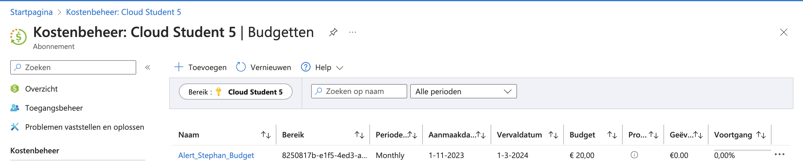
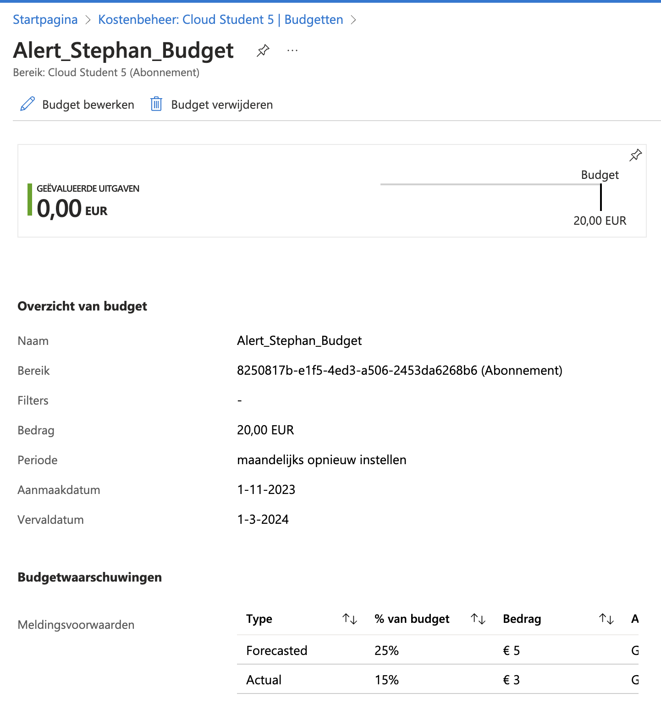

# Azure Cost Management

## Key-terms
- OPEX
- CAPEX
- Principes om kosten te reduceren
  - Plan (Planning)
  - Zichtbaarheid (Visibility)
  - Verantwoording (Accountability)
  - Optimalisatie (Optimization)
  - Iteratie (Iteration)
- Total Cost of Ownership (TCO)
---
## Opdrachten
>Maak een alert aan waarmee je eigen kosten kan monitoren.
>Begrijp de opties die Azure aanbiedt om je uitgaven in te zien.
---

## Bestudeer
- De Azure principes voor kostenmanagement
- De voorwaarden van de ‘Free subscription’
- Het verschil tussen CAPEX en OPEX.
- De TCO-calculator

---

### Bronnen

[learn.microsoft.com](https://learn.microsoft.com/nl-nl/azure/cost-management-billing/costs/cost-mgt-best-practices)

[Adam Marczak - Azure for Everyone](https://www.youtube.com/watch?v=7KEygnLtRyE)

[John Savill's Technical Training](https://www.youtube.com/watch?v=pE-bf8i5blU)

---

### Ervaren Problemen

Er zijn geen problemen geweest bij dit onderdeel.

---
### Resultaat

De Azure principes voor kostenmanagement
  1. **Plan (Planning)** - Uitgebreide, vooraf gemaakte planning biedt u de mogelijkheid om cloudgebruik aan uw specifieke bedrijfsvereisten aan te passen. Vraag uzelf: Welk zakelijk probleem moet ik oplossen? Welke gebruikspatronen worden verwacht van mijn resources? Met uw antwoorden kunt u de aanbiedingen selecteren die voor u geschikt zijn. Ze bepalen welke infrastructuur moet worden gebruikt en hoe deze wordt gebruikt om de efficiëntie van Azure te maximaliseren.
  2. **Zichtbaarheid (Visibility)** - Bij een goed gestructureerd kostenbeheer helpt u mensen te informeren over de kosten van Azure waarvoor ze verantwoordelijk zijn of voor het geld dat ze uitgeven. Azure heeft services die zijn ontworpen om u inzicht te geven in waar uw geld wordt uitgegeven. Profiteer van deze hulpprogramma's. Ze kunnen u helpen bij het vinden van resources die worden gebruikt, het verwijderen van afval en het maximaliseren van de kostenbesparingen.
  3. **Verantwoording (Accountability)** - Ken kosten in uw organisatie toe om ervoor te zorgen dat mensen verantwoordelijk zijn voor de uitgaven van hun team. Als u de Azure-uitgaven van uw organisatie volledig wilt begrijpen, moet u uw resources ordenen om inzicht te krijgen in de kostentoewijzing. Een goede organisatie helpt bij het beheren en verlagen van kosten en houdt mensen verantwoordelijk voor efficiënte uitgaven in uw organisatie.
  4. **Optimalisatie (Optimization)** - Onderneem actie om uw uitgaven te verminderen. Profiteer er maximaal van op basis van de bevindingen die zijn verzameld via planning en vergroot de zichtbaarheid van de kosten. U kunt bijvoorbeeld optimalisaties voor aankoop en licenties overwegen, samen met wijzigingen in de infrastructuurimplementatie.
  5. **Iteratie (Iteration)** - Iedereen in uw organisatie moet rekening houden met de levenscyclus van kostenbeheer. Ze moeten voortdurend betrokken blijven om de kosten te optimaliseren. Wees strikt over dit iteratieve proces en maak het een belangrijk grondbeginsel van verantwoordelijke cloud-governance in uw organisatie.

Het verschil tussen CAPEX en OPEX.
  1. CAPEX - staat voor Capital Expenditures. Dit zijn je kapitaaluitgaven, zoals het investeren in producten.
  2. OPEX - Operating Expenditures zijn terugkerende ofwel operationele kosten.

De TCO-calculator
    - Maakt een schatting van de kostenbesparing die kan worden gerealiseerd door de workloads te migreren naar Azure.

Om hoge kosten te voorkomen is er een alert gemaakt om dat te voorkomen. 

Ik krijg een melding als het bedrag van de prognose 5 euro is en de gemaakte kosten 3 euro.

