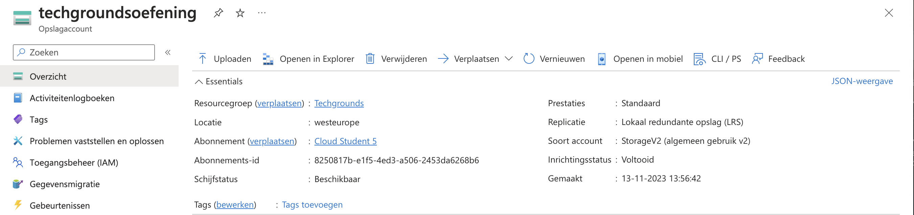
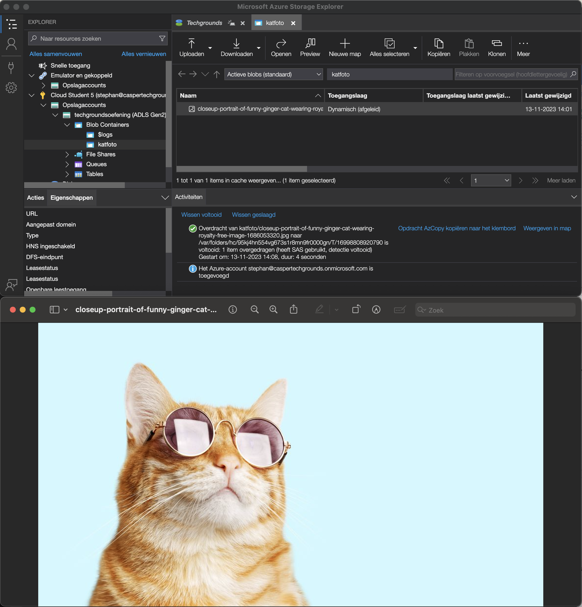
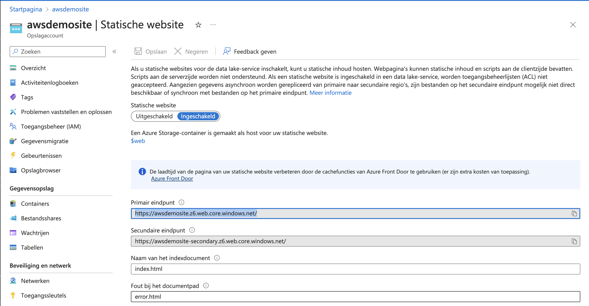
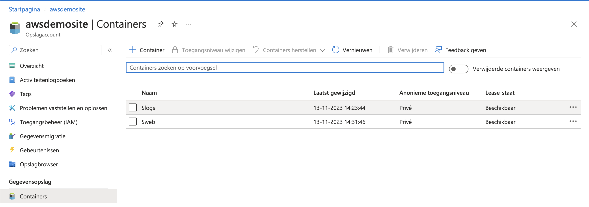
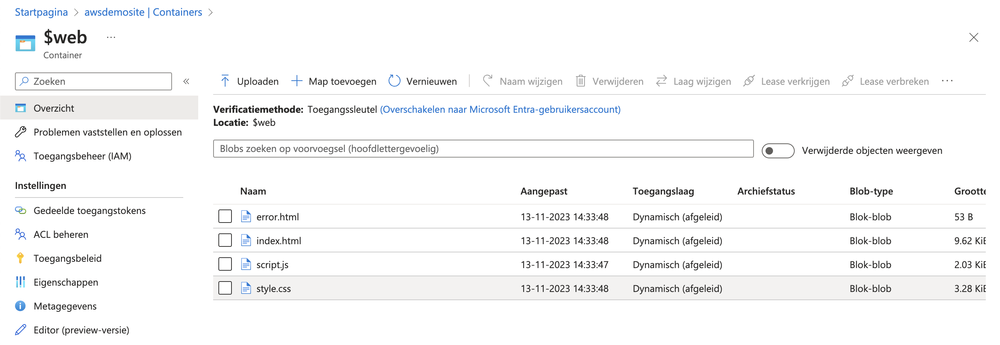
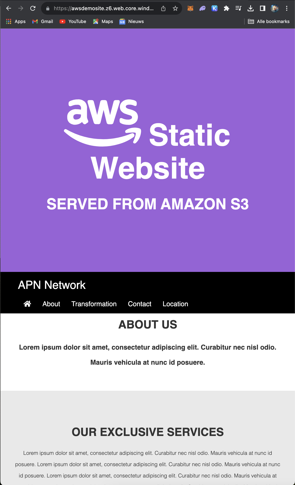

# Azure Storage Account

## Key-terms
- Blobs
- Files
- Disks
- Tables
- Azure Storage Explorer
- IaaS
- PaaS
  
---
## Opdrachten
>1. Opdracht 1
>- Maak een Azure Storage Account. Zorg dat alleen jij toegang hebt tot de data.
>- Plaats data in een storage service naar keuze via de console (bijvoorbeeld een kattenfoto in Blob storage).
>- Haal de data op naar je eigen computer door middel van de Azure Storage Explorer.
>
>2. Opdracht 2
>- Maak een nieuwe container aan.
>- Upload de 4 bestanden die samen de AWS Demo Website vormen.
>- Zorg dat Static Website Hosting aan staat.
>

---

## Bestudeer
---

### Bronnen

[Microsoft Azure](https://www.youtube.com/watch?v=AhuNgBafmUo) - How to create a storage account | Azure Portal Series

[Microsoft Azure](https://www.youtube.com/watch?v=gYpNC_tdbQQ) - How to host a static website with Azure Storage | Azure Tips and Tricks

---

### Ervaren Problemen

Er zijn geen problemen geweest bij dit onderdeel.

---
### Resultaat

**Opdracht 1**

Hier is een Storage account gemaakt en er is een foto van een kat geupload naar de Blob Storage.

Hier is het resultaat, In de Blob Storage kan je de foto vinden van de kat.

**Opdracht 2**

Via de optie Static Website heb ik mijn index en error pagina benoemd. Hier is dan ook de URL te zien.

Na het benoemen van de pagina's kan je hier de webcontainer vinden ($web)

Als je in de $web container zit kan je de webbestanden uploaden.

Wanneer dat allemaal is uitgevoerd kan je naar de webpagina gaan.

