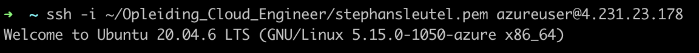
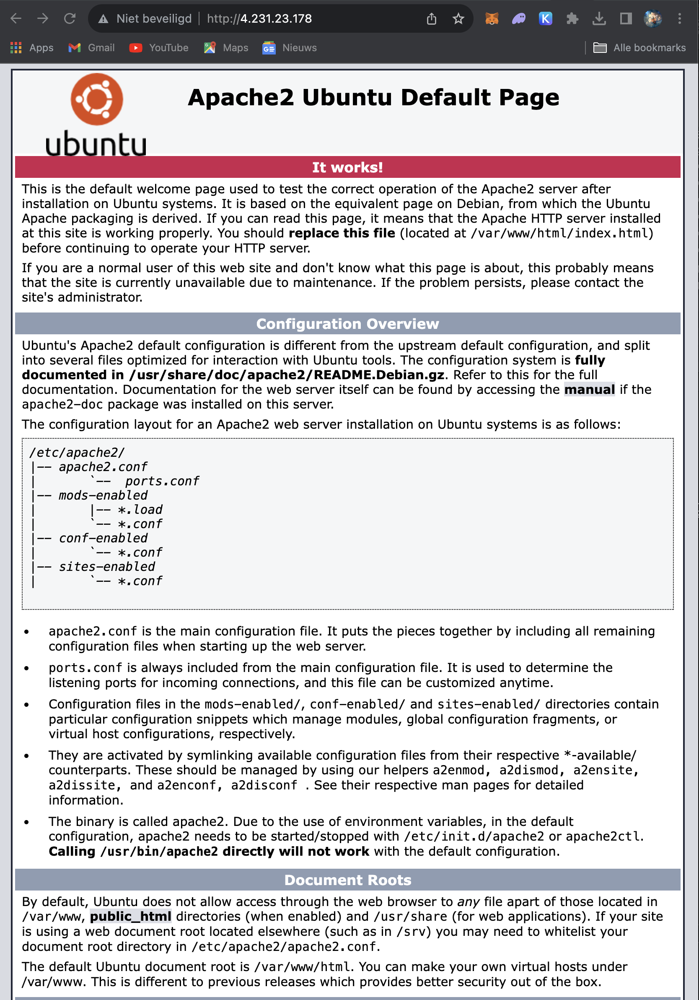

# Virtual Machines

## Key-terms
- Azure Virtual Machines
- Secure Shell (SSH) protocol
- Pay-as-you-go instances
- Reserved Instances
- Spot instances
---
## Opdrachten
>- Log in bij je Azure Console.
>- Controleer of je server werkt.
---

## Bestudeer
---

### Bronnen

---

### Ervaren Problemen

Er zijn geen problemen geweest bij dit onderdeel.

---
### Resultaat

Via Azure is een Vm aangemaakt en doormiddel van een SSH connectie had ik toegang tot de VM.

Doormiddel van de onderstaande commando's is er een webserver aangemaakt:
    
    sudo su
    apt update
    apt install apache2 -y
    ufw allow 'Apache'
    systemctl enable apache2
    systemctl restart apache2

