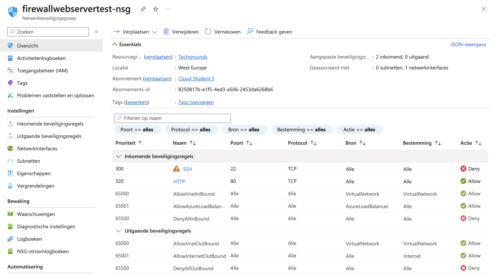

# Firewalls

## Key-terms
- VNets
- Hub-and-spoke network
- Public IP address
- Private IP address
- stateless firewall
- stateful firewall
- Azure Firewall
- Network Security Group (NSG)
- Intrusion Detection & Prevention System (IDPS)
---
## Opdrachten
>- Maak een Webserver aan waarbij de SSH en HTTP poorten open zijn.
>- Maak een NSG in je VNET. Zorg ervoor dat je webserver nog steeds bereikbaar is via HTTP, maar dat SSH geblokkeerd wordt.
>- Test of je NSG werkt.

---

## Bestudeer

- Het verschil tussen Basic en Premium Firewall.
- Het verschil tussen een Firewall en een Firewall beleid (Firewall Policy).
- Dat Azure Firewall veel meer is dan alleen een firewall.
- Het verschil tussen Azure Firewall en NSG.
---

### Bronnen

[Adam Marczak - Azure for Everyone](https://www.youtube.com/watch?v=VIEaz869njk) - AZ-900 Episode 23 | Azure Firewall

[Learn.microsoft.com](https://learn.microsoft.com/nl-nl/azure/firewall/overview) - Wat is Azure Firewall?

[Learn.microsoft.com](https://learn.microsoft.com/nl-nl/azure/firewall-manager/policy-overview) - Overzicht van Azure Firewall Manager-beleid

[John Savill's Technical Training](https://www.youtube.com/watch?v=JiUerkqyW0g&t=1553s) - Azure Firewall Deep Dive

[Adam Marczak - Azure for Everyone](https://www.youtube.com/watch?v=w8H5fWBHddA) - AZ-900 Episode 21 | Azure Security Groups | Network and Application Security Groups (NSG, ASG)

[Cloud Scholars](https://www.youtube.com/watch?v=qve0VuGLcyQ) - How to create an Azure network security group

---

### Ervaren Problemen

Er zijn geen problemen geweest bij dit onderdeel.

---
### Resultaat

**Azure Firewall** - Azure Firewall is een cloudeigen en intelligente netwerkfirewallbeveiligingsservice die het beste van bedreigingsbeveiliging biedt voor uw cloudworkloads die worden uitgevoerd in Azure. Het is een volledige stateful firewall als een service met ingebouwde hoge beschikbaarheid en onbeperkte cloudschaalbaarheid. Het biedt zowel oost-west- als noord-zuid verkeersinspectie. 

Azure Firewall wordt aangeboden in drie SKU's: Standard, Premium en Basic.

**Azure Basic Firewall** - Azure Firewall Basic is bedoeld voor kleine en middelgrote klanten (SMB) om hun Azure-cloud te beveiligen. te bieden. Het biedt de essentiële bescherming die SMB-klanten nodig hebben tegen een betaalbare prijs. 

Azure Firewall Basic is net als Firewall Standard, maar heeft de volgende belangrijke beperkingen:

Biedt alleen ondersteuning voor waarschuwingsmodus van Threat Intel
Vaste schaaleenheid voor het uitvoeren van de service op twee back-endinstanties van virtuele machines
Aanbevolen voor omgevingen met een geschatte doorvoer van 250 Mbps.

**Azure Firewall Premium** - Azure Firewall Premium biedt geavanceerde mogelijkheden, zoals op handtekeningen gebaseerde IDPS, om snelle detectie van aanvallen mogelijk te maken door te zoeken naar specifieke patronen. Deze patronen kunnen bytereeksen bevatten in netwerkverkeer of bekende schadelijke instructiereeksen die worden gebruikt door malware. Er zijn meer dan 67.000 handtekeningen in meer dan 50 categorieën die in realtime worden bijgewerkt om bescherming te bieden tegen nieuwe en opkomende aanvallen. De misbruikcategorieën omvatten malware, phishing, muntanalyse en Trojaanse aanvallen.

**Azure Firewall Policy** - Firewallbeleid is de aanbevolen methode om uw Azure Firewall te configureren. Het is een globale resource die kan worden gebruikt in verschillende Azure Firewall-exemplaren in Beveiligde virtuele hubs en virtuele netwerken voor hubs. Beleidsregels werken in verschillende regio’s en abonnementen.

**Verschil tussen Azure Firewall & NSG** - Een NSG is doelgerichter en wordt geïmplementeerd op bepaalde subnetten en/of netwerkinterfaces, terwijl een Azure Firewall het verkeer breder controleert. Het toepassen van regels op basis van IP-adressen, poortnummers, netwerken en subnetten is mogelijk met zowel firewalls als NSG.

## Opdracht

Er is een NSG aangemaakt in Azure waarbij poort 22 nu gesloten is en poort 80 open.
 

Omdat poort 22 gesloten is kan ik via de command line geen connectie meer maken met mijn VM. 

Wel is het nog mogelijk om de webserver te bezoeken.

