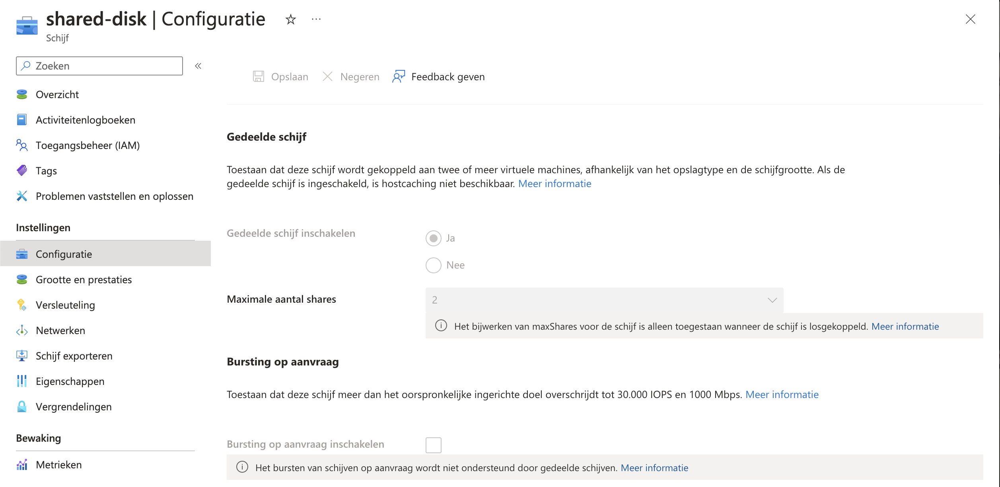
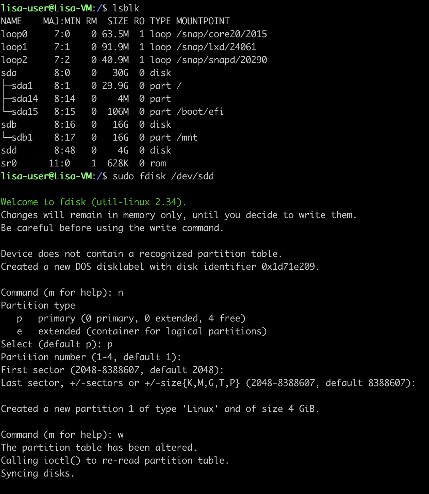
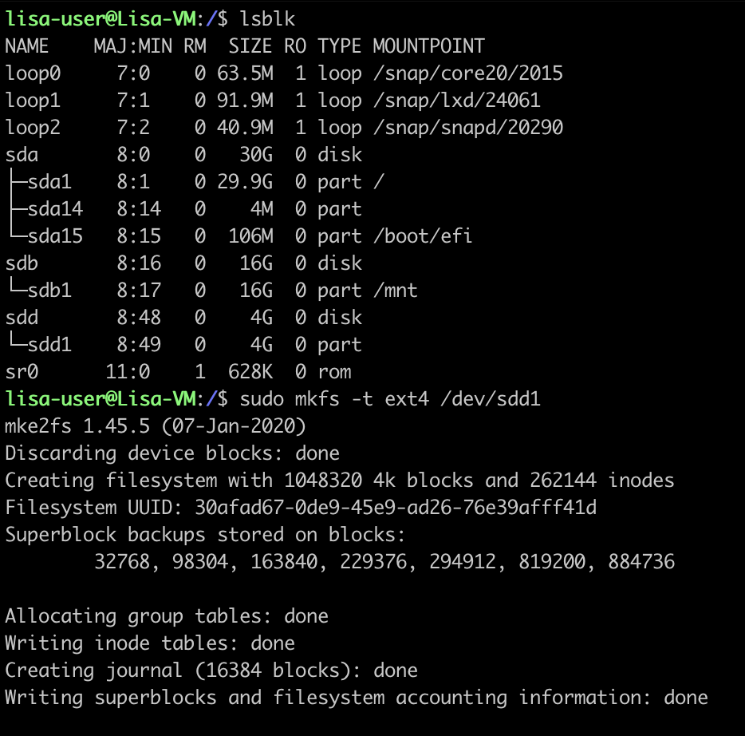
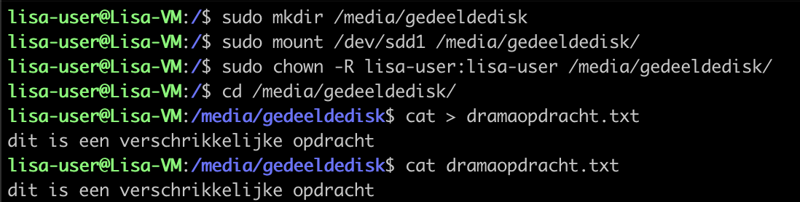
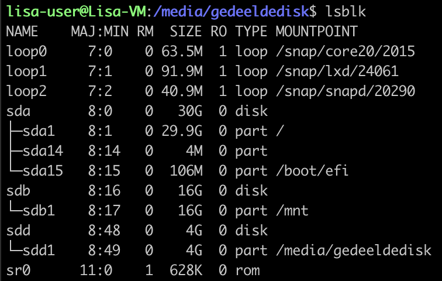
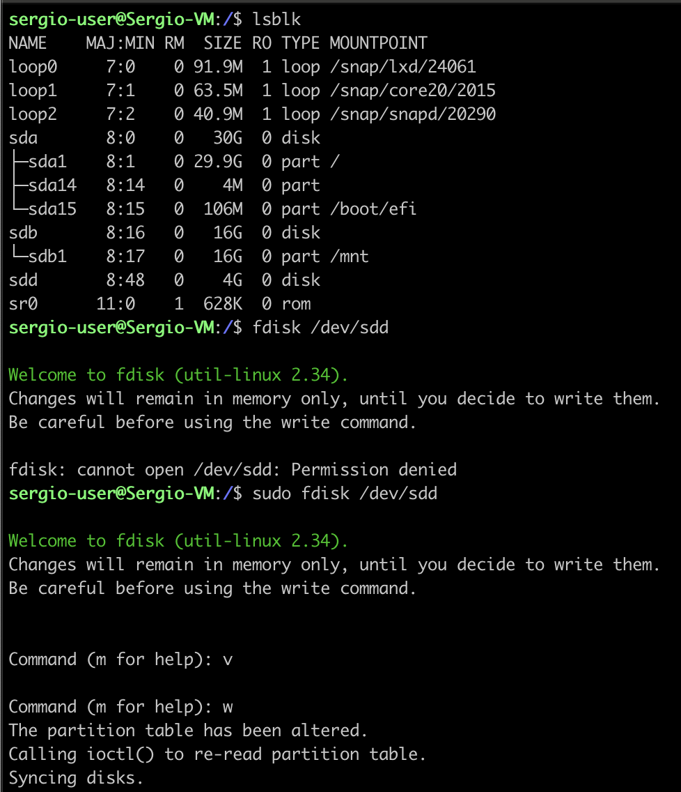
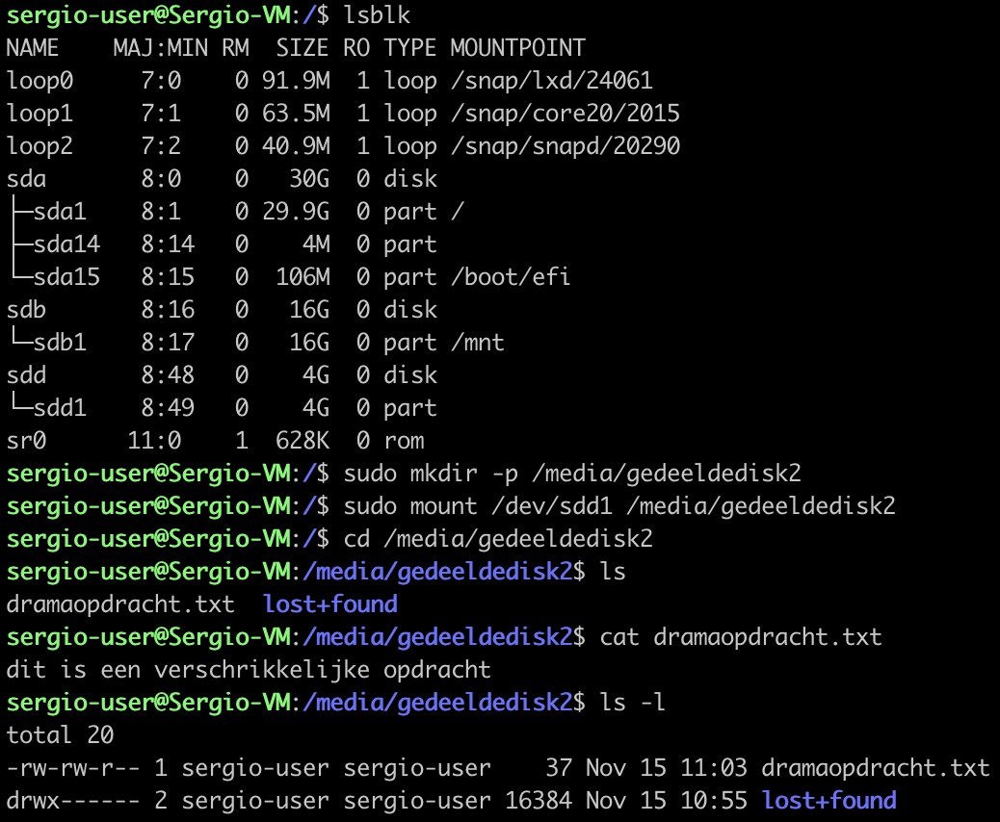
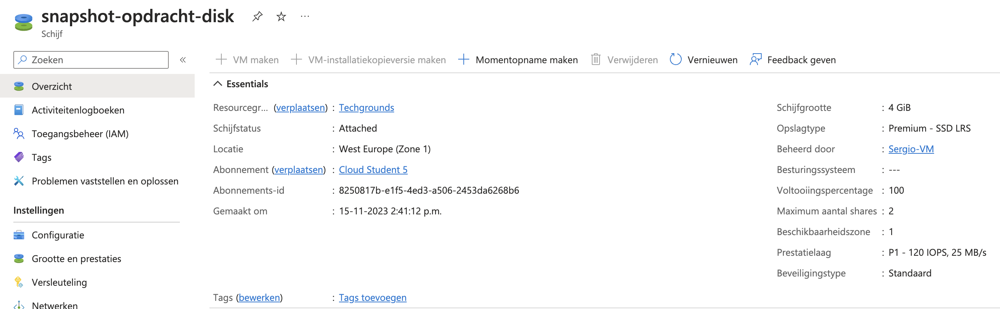
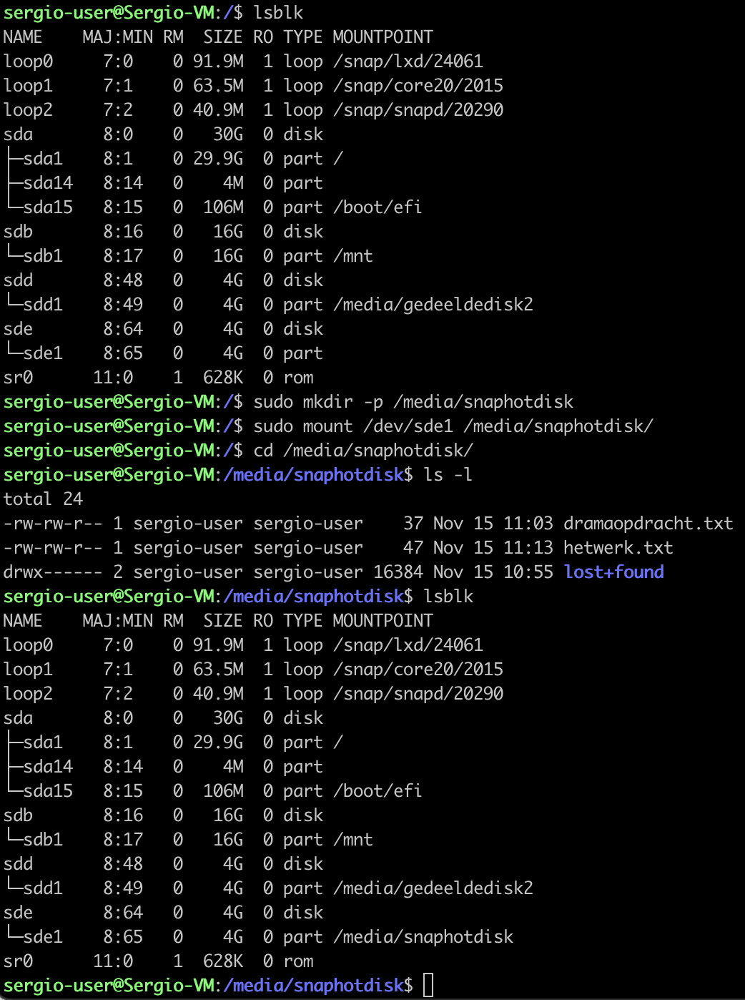

# Azure Disk Storage

## Key-terms
- Virtual Hard drive
- OS Disk
- Data Disk
- Managed Disk
- Unmanaged Disk
- Incremental Snapshots
  
---
## Opdrachten
>- Start 2 Linux Vms's, zorg dat je voor beide toegang hebt via SSh.
>- Maak een Azure Managed Disk aan en koppel deze aan beide VMs tegelijk.
>- Creëer op je eerste machine een bestand en plaats deze op de Shared Disk.
>- Kijk op de tweede machine of je het bestand kan lezen. (let op: het kan zijn dat je de disk opnieuw moet mounten op je 2e VM)
>- Maak een snapshot van de schijf en probeer hier een nieuwe Disk mee te maken.
>- Mount deze nieuwe Disk en bekijk het bestand.

---

## Bestudeer
---

### Bronnen

[Learn.microsoft.com](https://learn.microsoft.com/en-us/azure/virtual-machines/disks-types) - Azure managed disk types

[Will Brock](https://www.youtube.com/watch?v=f_9okkunX40) - Azure #10 - Managed Disks | Azure Tutorial

[LinuxHelp](https://www.youtube.com/watch?v=VsL2GN1KtI0) - How to create, attach, and mount a disk to Linux VM (Microsoft Azure)

[Cloud Security Training & Consulting](https://www.youtube.com/watch?v=aI9ydCFcjF4) - AZ104 Attaching a Data Disk to Azure Ubuntu, partition, format and mount for use - Azure Admin

[Learn.microsoft.com](https://learn.microsoft.com/en-us/azure/virtual-machines/linux/attach-disk-portal?tabs=ubuntu) - Use the portal to attach a data disk to a Linux VM

[Learn.microsoft.com](https://learn.microsoft.com/en-us/answers/questions/1296335/how-to-mount-the-existing-shared-disk-to-linux-vm) - How to mount the existing shared disk to Linux VM

---

### Ervaren Problemen

Alles was een probleem. Er zijn weinig bronnen te vinden op het internet. Had graag een voorbeeld gezien van hoe deze opdracht is zijn werk gaat. Heb nu maar delen gebruikt van allemaal bronnen en ben gaan goochelen. De opdracht heeft veel te lang geduurd en heeft me zeer gefrustreerd. 

---
### Resultaat

Er is in Azure een Disk aangemaakt die kan worden gekoppeld aan 2 VM's, namelijk Lisa-VM & Sergio-VM.

Nu gaan we over naar de command line voor verdere configuraties.
Met de onderstaande commando krijg ik een lijst te zien van alle block devices
    
    lsblk

Daarna heb ik een command gebruikt om in de ***sdd*** disk een partion table aan te maken.
    
    sudo fdisk /dev/sdd
Er wordt vervolgens gebruikt om een partition type en die laat ik op de default staan (p), de volgende 3 stappen laat ik ook op default staan.

Nadat er een nieuwe partition is aangemaakt typ ik ***w*** in waarbij de partition table is gewijzigd.

met de command lsblk kijken we weer naar de lijst en zien we dat ***sdd1*** is aangemaakt.
Nu moet er een command worden ingevoerd om een file systeem aan te maken.

    sudo mkfs -t ext4 /dev/sdd1

Er moet een nieuwe map worden aangemaakt en dat is gedaan met

    sudo mkdir /media/gedeeldedisk
met de volgende command hebben we de map gemount op de disk.

    sudo mount /dev/sdd1 /media/gedeeldedisk/

met de ***Chown*** command heb ik ***lisa-user*** eigenenaar gemaakt van het bestand.

ik heb daarna een tekst bestand aangemaakt ***dramaopdracht.txt*** met de tekst: dit is een verschrikkelijke opdracht

Hier is te zien dat ***/media/gedeeldedisk*** gemount is op ***sdd1***

Nu is de tweede VM aan de beurt. Weer is de ***lsblk*** command gebruikt. Hier is te zien dat het in deze VM ook om ***sdd*** gaat.
met ***sudo fdisk /dev/sdd*** gaan we weer de partition table wijzigen. Echter gebruiken we dit keer de ***v*** en daarna de ***w***.

Met ***lsblk*** kijk ik weer naar de lijst en zie ik nu ***sdd1*** staan. Ik maak een nieuwe map aan met mkdir. ik mount de map op de disk. En wanneer ik naar de map ga zie ik het bestand ***dramaopdracht*** staan met de tekst: dit is een verschrikkelijke opdracht.

Na dit allemaal te hebben gedaan moet er een snapshot worden aangemaakt van de disk en van de snapshot moet er disk worden aagemaakt en ook worden gemount.

Met de command ***lsblk*** zien we dat ***sde1*** erbij is gekomen. Daar hebben we gelijk een map voor aangemaakt namelijk ***/media/snapshotdisk***. Die map mounten we gelijk aan ***/dev/sde1***. Zodra je naar de map gaat zie we 2 bestanden staan namelijk ***dramaopdracht.txt & hetwerk.txt***.

ß