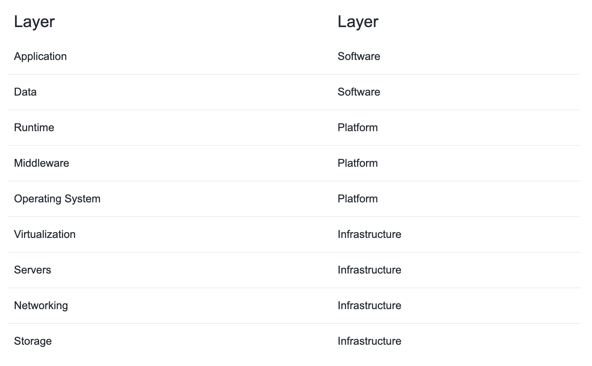
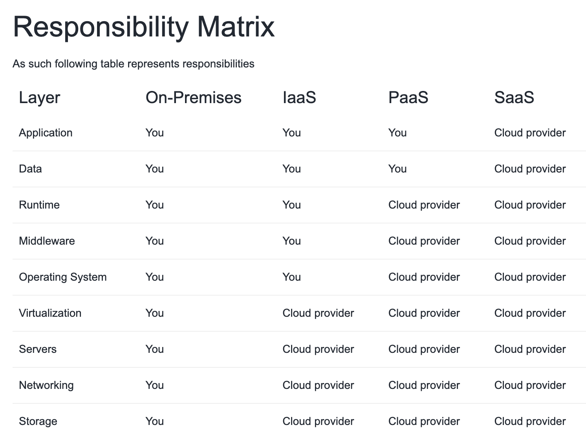

# Shared Responsibility Model

## Key-terms
- SaaS
- PaaS
- IaaS
- On-premise
---
## Opdrachten

---
## Bestudeer
>Het Azure Shared Responsibility model
---

### Bronnen

[Adam Marczak - Azure for Everyone](https://www.youtube.com/watch?v=9CVBohl6w0Q) - AZ-900 Episode 5 | IaaS vs PaaS vs SaaS cloud service models | Microsoft Azure Fundamentals Course

[Marczak.io](https://marczak.io/az-900/episode-05/cheat-sheet/) - AZ-900 Episode 05 - Cheat Sheet

---

### Ervaren Problemen

---
### Resultaat

### Service Models responsibilities

***As a service*** means which party will manage the particular layer and all the layers below.

**Software layer** - consists the application (application code and set) & the application data
**Platform layer** - means all the supporting software and the operating system required to host the application

**Infrastructure** - layer consists hardware the infrastructure and virtualization required to host the platform