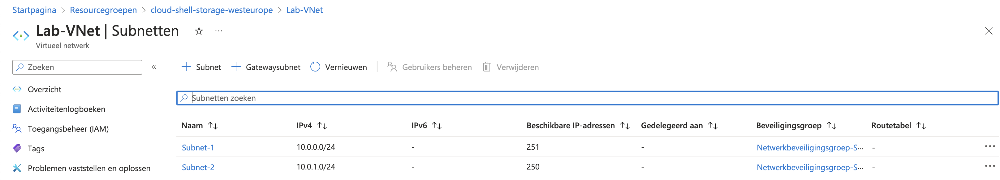
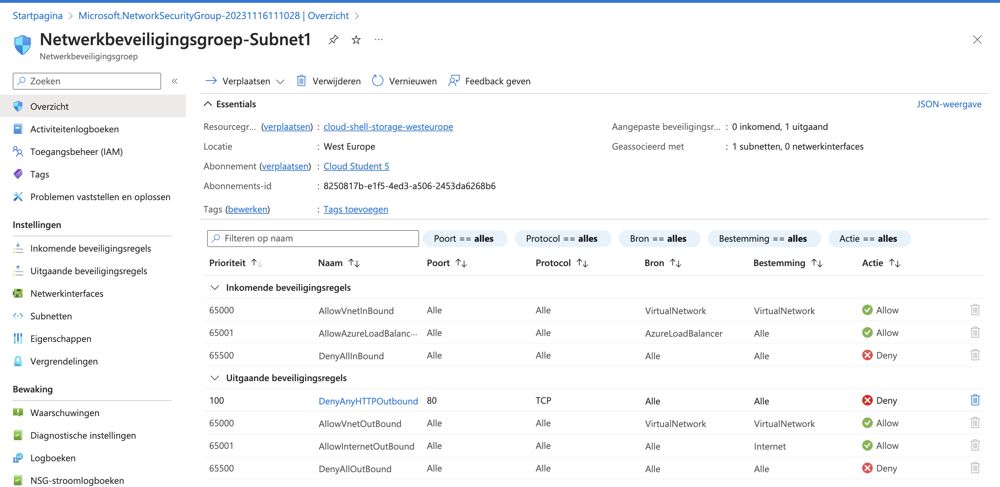
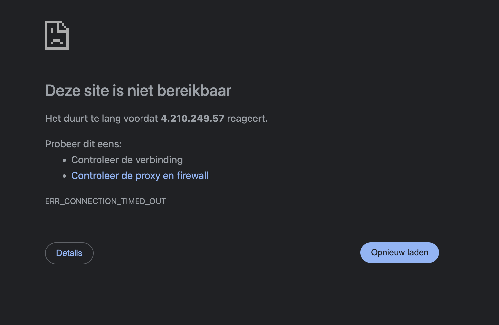
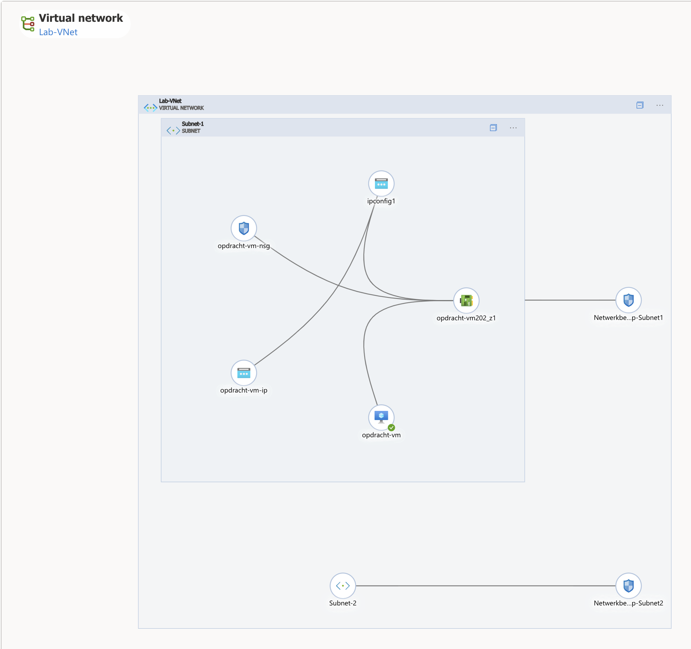
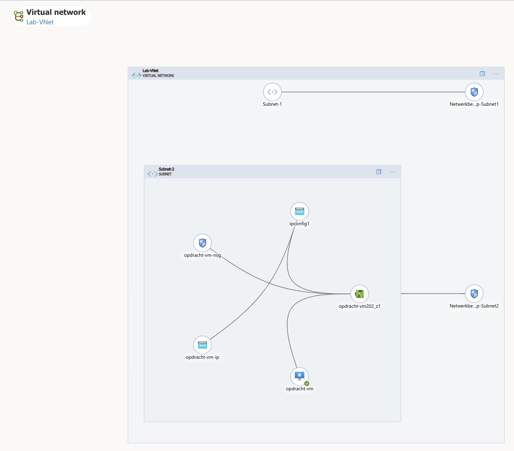
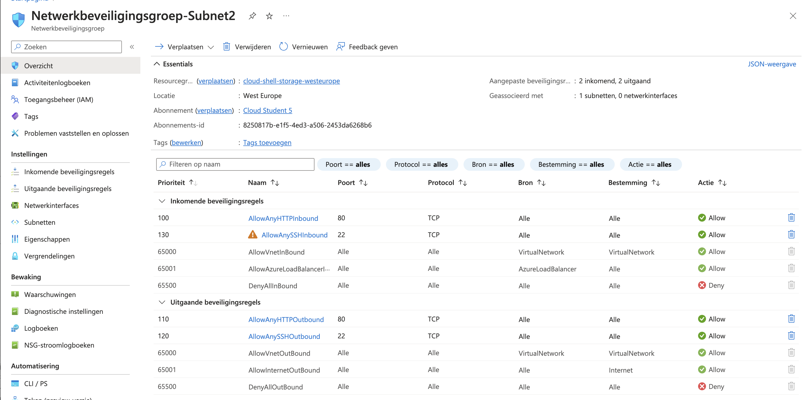

# Azure Virtual Network

## Key-terms
- Azure Virtual Networks (VNets)
- VNets hebben de volgende verantwoordelijkheden:
  - (Netwerk-)isolatie en -segmenttatie
  - Internetcommunicatie
  - communicatie tussen Azure resources
  - Communicatie met on-premises resources
  - Routeren van netwerkverkeer
  - Filteren van netwerkverkeer
  - Verbinden van andere VNets
- Point-to-site VPNs: Het azure Vnet wordt benaderd met een VPN vanaf een on-prem computer.
- Site-to-site VPNs: De on-prem VPN device of gateway wordt verbonden met de Azure VPN Gateway. hierdoor krijg je effectief 1 groot local network.
- Azure Expressroute: Dit is een fysieke verbinding vanaf je lokale omgeving naar Azure.
- Virtual Network Peering
- User Defined Routing (UDR)

---
## Opdrachten

> ### Opdracht 1
>
>Maak een Virtual Network met de volgende vereisten:
>- Region: West europe
>- Name: Lab-VNet
>- IP range:10.0.0.0/16
>
>Vereisten voor subnet 1:
>- Name: Subnet-1
>- IP Range: 10.0.0.0/24
>- Dit subnet mag geen route naar het internet hebben
>
>Vereisten voor subnet 2:
>- Name: Subnet-2
>- IP Range: 10.0.1.0/24
>
> ### Opdracht 2
>Maak een VM met de volgende vereisten:
>
>Een apache server moet met de volgende custom data geïnstalleerd worden:
>- #!/bin/bash
>- sudo su
>- apt update
>- apt install apache2 -y
>- ufw allow 'Apache'
>- systemctl enable apache2
>- systemctl restart apache2
>
>Er is geen SSH access nodig, wel HTTP
>- Subnet: Subnet-1
>- Public IP: Enabled
>
>Controleer of je website bereikbaar is
---

## Bestudeer
---

### Bronnen

[Adam Marczak - Azure for Everyone](https://www.youtube.com/watch?v=5NMcM4zJPM4) - AZ-900 Episode 10 | Networking Services | Virtual Network, VPN Gateway, CDN, Load Balancer, App GW

---

### Ervaren Problemen

---
### Resultaat

Hier is een virtual Network aangemaakt met 2 subnetten.

Voor deze subnet is er een networkbeveiligingsgroep gemaakt en is poort 80 gesloten. Echter was er geen toegang ondanks dat ik poort 80 had gesloten.

Omdat al het verkeer is gesloten is de webserver niet bereikbaar.

Hier is de diagram te zien van de VNet.

Ik heb vervolgens de VM verplaatst naar Subnet 2.

Ik heb hierbij poorten 80 en 22 geopend zodat ik bij de webserver kon komen en dat ik met mij CLI in de VM kon komen

