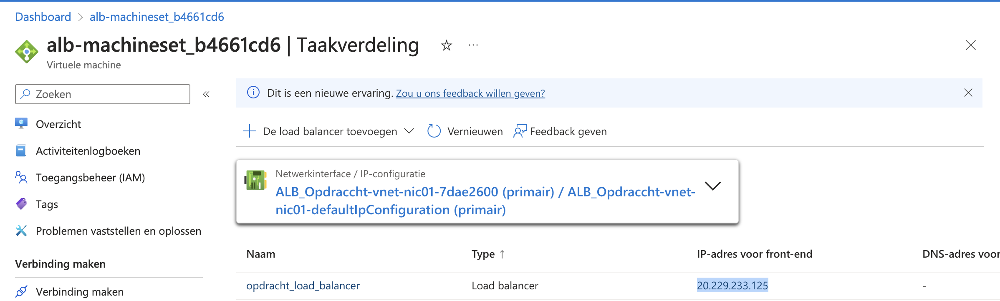

# ALB & Auto Scaling

## Key-terms
- Autoscaling
- Spiky Workload
- Scale Set
- Image
- Reimage optie
- Azure Monitor
- Load Balancer
- Endpoint
- Azure heeft twee managed oplossingen voor load balancing naar een fleet van servers:
    - Je krijgt deze gratis bij een VM Scale Set. De ALB werkt op laag 4 van de OSI stack (TCP/UDP). Een ALB kan alleen routeren naar Azure resources.
    - Application Gateway: Deze load balancer werkt op laag 7 van de OSI stack (HTTP/HTTPS). Ook heeft het support voor onder andere SSL termination en Web Application Firewall (WAF) features. Een Application Gateway kan routeren naar elk routable IP address.
---
## Opdrachten
>***Opdracht 1***
>
>Maak een Virtual Machine Scale Set met de volgende vereisten:
>- Ubuntu Server 20.04 LTS - Gen1
>- Size: Standard_B1ls
>- Allowed inbound ports:
>  1. SSH (22)
>  2. HTTP (80)
>- OS Disk type: Standard SSD
>- Networking: defaults
>- Boot diagnostics zijn niet nodig
>- Custom data:

    #!/bin/bash
    sudo su
    apt update
    apt install apache2 -y
    ufw allow 'Apache'
    systemctl enable apache2
    systemctl restart apache2
>- Initial Instance Count: 2
>- Scaling Policy: Custom
>- Aantal VMs: minimaal 1 en maximaal 4
>- Voeg een VM toe bij 75% CPU gebruik
>- Verwijder een VM bij 30% CPU gebruik
>
>***Opdracht 2***
>- Controleer of je via het endpoint van je load balancer bij de webserver kan komen.
>- Voer een load test uit op je server(s) om auto scaling the activeren. Er kan een delay zitten in het creëren van nieuwe VMs, afhankelijk van de settings in je VM Scale Set. Let op: de Azure Load Testing service kan prijzig zijn. Je kan ook inloggen op de VM om een handmatige stress test te doen.

---

## Bestudeer
---

### Bronnen

[Microsoft Azure](https://www.youtube.com/watch?v=LS8ZPbQzRpc) - How to automatically scale Azure App Services | Azure Tips and Tricks

[John Savill's Technical Training](https://www.youtube.com/watch?v=EbiID16PDuk) - VMSS Autoscaling Demo

[Tony Teaches Tech](https://www.youtube.com/watch?v=2kpd7HceFz4) - How to Use Apache Bench to Load Test Your Website (ab linux command tutorial)

---

### Ervaren Problemen

Het inschalen ging snel en dat was top, echter heb ik niet gezien wat er gebeurt bij het uitschalen ondanks een intensieve stresstest via de command line.

---
### Resultaat

Er is een Virtual Machine Scale Set aangemaakt met 2 instances. Daarnaast Mag de Scale Set minimaal 1 VM hebben en maximaal 4. Er komt een VM bij als gemiddeld 75% van de CPU wordt gebruikt en gaat een VM weg als er gemiddeld minder dan 30% CPU wordt gebruikt. Op het moment dat ik de opdracht ging documenter was de Virtual Machine Scale set naar 1 gegaan.

Hier is de Load Balancer te zien met het IP adres.

En hier de webserver.

Het is mogelijk om het schalen aan te passen en hier kan je alle regels vinden.

Ondertussen was ik bezig met een stresstest om te zien of er een nieuwe vm komt maar de stresstest kwam net niet boven de 75% uit in Azure. Hier is de command te zien voor de stress test.

Bij de regels van het uitschalen kan je zien hoeveel er gemiddeld aan CPU wordt gebruikt. Met een intensieve stress test kwam ik steeds niet bij de 75%.

Hier kan je de regels zien van het inschalen tijdens de stress test.

Omdat ik toch heel graag wilde zien dat er 1 VM bij kwam had ik het percentage verlaagd naar 70% en kon ik gelijk zijn dat het werkt. 

