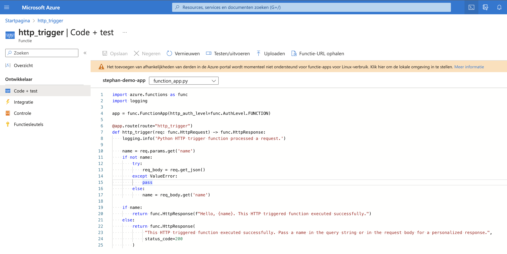

# Onderwerpen week 6

## Key-terms
---
## Opdrachten
>- Doe praktische ervaring op met:
>   - Microsoft Entra ID
>   - Azure Monitor
>   - CosmosDB
>   - Azure Functions
>   - Event Grid, Queue Storage & Service Bus
---
## Bestudeer
>- Doe theoretische kennis op van:
>   - Azure Containers
>   - Azure Support Plans
>   - Azure Advisor
>   - Azure App Configuration
>   - Azure Monitor Logs
---

### Bronnen

[Microsoft Mechanics](https://www.youtube.com/watch?v=0qZzcK1mHwA) - Microsoft Entra ID Beginner's Tutorial (Azure Active Directory)

[Andy Malone MVP](https://www.youtube.com/watch?v=ThT3n2Yass4) - Microsoft Entra ID The Complete Beginners Guide

[John Savill's Technical Training](https://www.youtube.com/watch?v=v68jL-l9Fww) - Functionality and Usage of Azure Monitor - AZ-900 Certification Course

[CBT Nuggets](https://www.youtube.com/watch?v=0OPMzAJjMxM) - How Does Azure Monitor Work?

[KnowOps](https://www.youtube.com/watch?v=LOjBMJqOp6Q) - Azure Monitor: The essentials every admin should know

[CBT Nuggets](https://www.youtube.com/watch?v=hBY2YcaIOQM) - What is Azure Cosmos DB?

[Adam Marczak - Azure for Everyone](https://www.youtube.com/watch?v=R_Fi59j6BMo) - Azure Cosmos DB Tutorial | Globally distributed NoSQL database

[Microsoft Azure](https://www.youtube.com/watch?v=_9moXcR2Suo) - How to build serverless APIs with Azure Functions | Azure Tips and Tricks

[Adam Marczak - Azure for Everyone](https://www.youtube.com/watch?v=Vxf-rOEO1q4) - Azure Function Apps Tutorial | Introduction for serverless programming

[Apostolos Athanasiou](https://www.youtube.com/watch?v=s4-ddiTD4ec) - Azure Functions - Getting started with Azure Functions - Tutorial for beginners

[Adam Marczak - Azure for Everyone](https://www.youtube.com/watch?v=TujzkSxJzIA) - Azure Event Grid Tutorial

[ExamPro](https://www.youtube.com/watch?v=CXfeF46sIbM) - Comparing Queuing Storage Queue vs Azure Service Bus - AZ 204

[Adam Marczak - Azure for Everyone](https://www.youtube.com/watch?v=JQ6KhjU5Zsg) - Azure Queue Storage Tutorial

[Microsoft Azure](https://www.youtube.com/watch?v=EUitQ8DaZW8) - Why you should care about containers

[Adam Marczak - Azure for Everyone](https://www.youtube.com/watch?v=jAWLQFi4USk) - Azure Container Instances Tutorial | Serverless containers in cloud

[Karel Kotyza](https://www.linkedin.com/pulse/what-containers-azure-karel-kotyza/) - What are containers in Azure?

[ExamPro](https://www.youtube.com/watch?v=joBtG9lURBY) - Billing and Pricing - Azure Support

[Adam Marczak - Azure for Everyone](https://www.youtube.com/watch?v=58_6MkB2znI&t=3s) - AZ-900 Episode 20 | Azure Advisor

[Adam Marczak - Azure for Everyone](https://www.youtube.com/watch?v=t6m13DxUJMc) - Azure App Configuration Tutorial

[John Savill's Technical Training](https://www.youtube.com/watch?v=lzVQ3NqMnTE)

---

### Ervaren Problemen

---
## Resultaat

### Microsoft Entra

Ik heb met mijn eigen emailadres ingelogd in Microsoft Entra. Het emailadres dat ik in Azure gebruik is onderdeel van Techgrounds en daarin kunnen wij weinig aanpassingen doen omdat voor ons beperkt is. Ik heb in mijn eigen account ben ik bezig met het aanmaken van de User ***demo-entra***.

Op deze pagina kan je de gebruiksers zien. Ik heb wat persoonlijk is weggehaald.

Op deze pagina kan je de user zien en van alles aanpassen.

Daarnaast heb ik in Entra ook de group ***Techgrounds*** aangemaakt.

Hier kan je in de groep kijken, tijdens het aanmaken van de groep heb ik mezelf toegevoegd aan de groep plus de demo user. Ik heb mezelf eigenaar gemaakt van de groep.

### Azure Monitor

Azure Monitor is a comprehensive monitoring solution for collecting, analyzing, and responding to monitoring data from your cloud and on-premises environments. You can use Azure Monitor to maximize the availability and performance of your applications and services. It helps you understand how your applications are performing and allows you to manually and programmatically respond to system events.

Azure Monitor collects and aggregates the data from every layer and component of your system across multiple Azure and non-Azure subscriptions and tenants. It stores it in a common data platform for consumption by a common set of tools which can correlate, analyze, visualize, and/or respond to the data. You can also integrate additional Microsoft and non-Microsoft tools.

### Cosmos DB

Om te zien wat CosmosDB is heb ik geprobeerd om een Cosmos Database te maken. Hieronder zie je dat ik er mee bezig ben om het aan te maken.

Dit krijg je te zien als je het hebt aangemaakt.

Ik heb 2 items aangemaakt in de ToDoList

Vervolgens heb ik de Query uitgevoerd en dit is het resultaat.

Hier kan je de stats zien van de Query, ik heb maar 2 items dus er is niet veel te zoeken. De 2 items hebben 2.28 RUs (Request Units) gekost. 

### Azure Functions

Hier heb ik een functions app aagemaakt.

Ik heb vervolgens een http-trigger template uitgekozen. Ik krijg dan een code die kan worden aangepast.

Ik heb daarna de een test uitgevoerd en mijn output was: ***Hello test123, this HTTP triggered function executed succesfully***

### Azure Event Grid

Azure Event Grid is a highly scalable, fully managed Pub Sub message distribution service that offers flexible message consumption patterns using the MQTT and HTTP protocols. With Azure Event Grid, you can build data pipelines with device data, integrate applications, and build event-driven serverless architectures. Event Grid enables clients to publish and subscribe to messages over the MQTT v3.1.1 and v5.0 protocols to support Internet of Things (IoT) solutions. Through HTTP, Event Grid enables you to build event-driven solutions where a publisher service announces its system state changes (events) to subscriber applications. Event Grid can be configured to send events to subscribers (push delivery) or subscribers can connect to Event Grid to read events (pull delivery)

### Azure Qeue Storage

Azure Queue Storage is a service for storing large numbers of messages. You access messages from anywhere in the world via authenticated calls using HTTP or HTTPS. A queue message can be up to 64 KB in size. A queue may contain millions of messages, up to the total capacity limit of a storage account.

### Azure Bus Storage

Microsoft Azure Service Bus is a Cloud-based Messaging as a Service (MaaS) Platform. It is a high-performance, real-time, and fault-tolerant service that transfers messages between your applications and databases securely. 

Microsoft Azure Service Bus can connect to any application, service, or a device running in the cloud and can establish communication with other applications, services, or receivers seamlessly. Blazoned with features like Advanced Messaging Queuing Protocol (AMQP), First-In, First-Out (FIFO) Messaging, Asynchronous Communication, and Publish/Subscribe capabilities, Azure Service Bus can reliably transmit instructions to all your applications to achieve your goals of application.

### Azure Containers

Azure containers are a popular and efficient way to deploy and manage applications in the cloud. They offer a wide range of benefits, such as increased flexibility, scalability, and cost-effectiveness, but also have some potential drawbacks that should be considered before making a decision.
Definition of Container is:
- Container is virtualization of operating system.

It is an application, that is packed with all the files, configurations and dependencies to run it.
- It is a new evolution of virtualization
  
As the virtual machines are virtualization of hardware, the containers are virtualization of OS.

### Azure Support Plans

Every Azure subscription includes free access to billing and subscription support, Azure products and services documentation, online self-help documentation, white papers, and community support forums.

Microsoft offers four support plans that can provide you with technical support:

**Basic:** - Available to all Microsoft Azure accounts, this is the only free plan and does not have any active support from Azure, the user has access to community forums, self-help documentation, etc, and can raise as many support tickets as required.

**Developer:** - Best suggested for trial and non-production environments, This plan has active support from Azure in the form of access to support engineers via email during standard Business hours. The response time from Microsoft for this plan is within eight hours.

**Standard:** - Best suggested for production workload environments, this plan is an upgrade of the developer plan and provides support in the form of 24×7 access to support engineers via email and phone. The response time from Microsoft for this plan is within one hour.

**Professional Direct:** - Absolutely necessary for business-critical environments, this plan also offers 24/7 technical support with one-hour response time but also includes operational support, training, and proactive guidance from a ProDirect delivery manager.

If you have an enterprise agreement with Microsoft, you can purchase any of these plans except the Developer plan and the bill will be incorporated in the enterprise agreement.

### Azure Advisor

Personalized consultant service
Designed to provide recommendations and best practices for:
- Cost (SKU sizes, idle services, reserved instances, etc.)
- Security (MFA settings, vulnerability settings, agent installations, etc.)
- Reliability (redundancy settings, soft delete on blobs, etc.)
- Performance (SKU sizes, SDK versions, IO throttling, etc.)
- Operational Excellence (service health, subscription limits, etc.)
Actionable recommendations

### Azure App Configuration

Azure App Configuration provides a service to centrally manage application settings and feature flags. Modern programs, especially programs running in a cloud, generally have many components that are distributed in nature. Spreading configuration settings across these components can lead to hard-to-troubleshoot errors during an application deployment. Use App Configuration to store all the settings for your application and secure their accesses in one place.

### Azure Monitor Logs

Azure Monitor Logs is a feature of Azure Monitor that collects and organizes log and performance data from monitored resources. Several features of Azure Monitor store their data in Logs and present this data in various ways to assist you in monitoring the performance and availability of your cloud and hybrid applications and their supporting components.

Along with using existing Azure Monitor features, you can analyze Logs data by using a sophisticated query language that's capable of quickly analyzing millions of records. You might perform a simple query that retrieves a specific set of records or perform sophisticated data analysis to identify critical patterns in your monitoring data. Work with log queries and their results interactively by using Log Analytics, use them in alert rules to be proactively notified of issues, or visualize their results in a workbook or dashboard.

