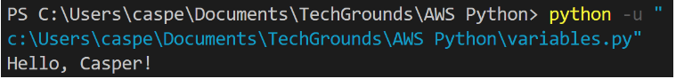
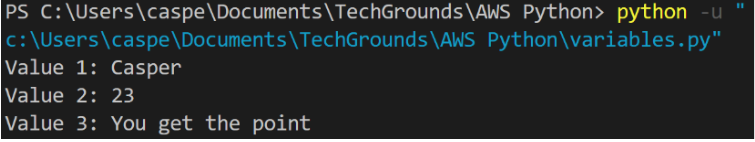
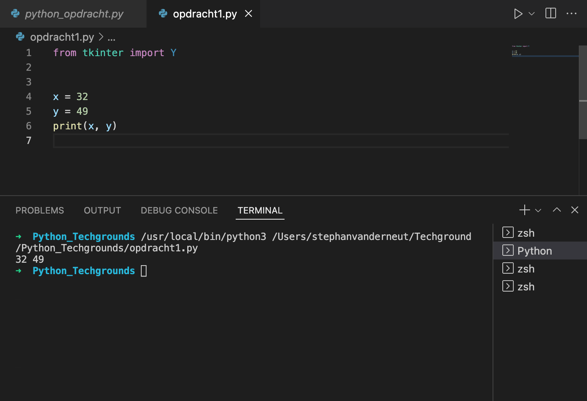
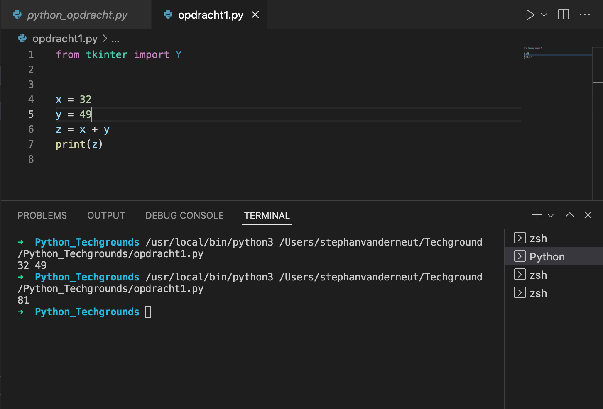
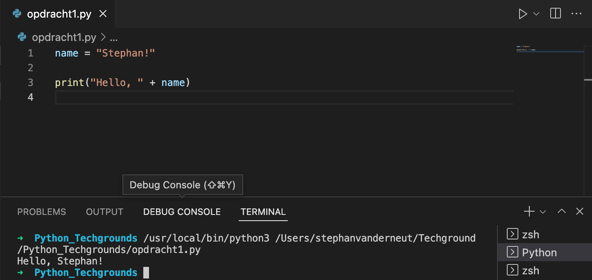
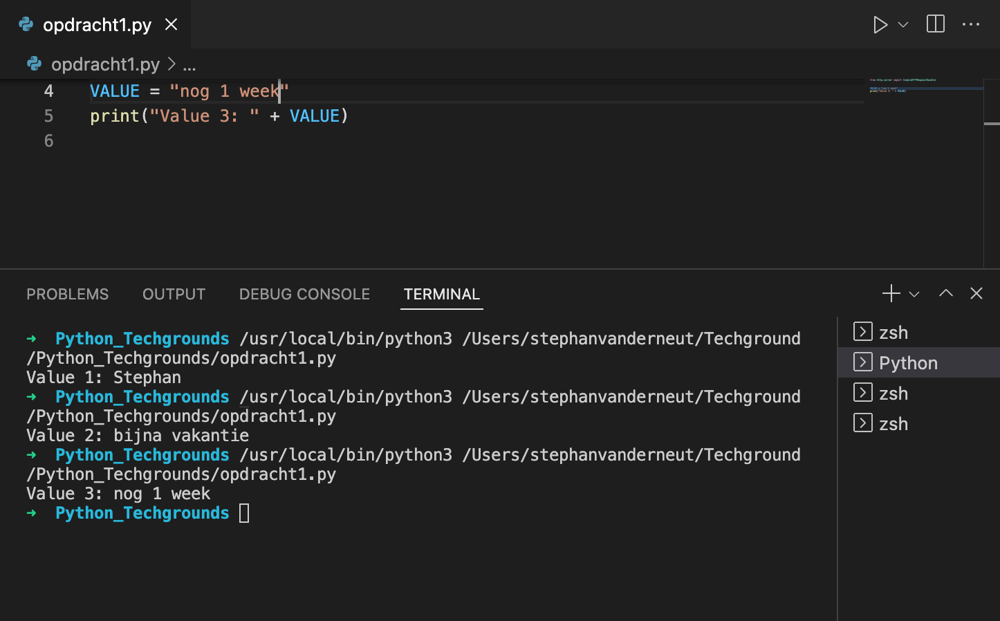

# Variables

## Key-terms
- Value
- String
---
## Opdrachten
> ### Exercise 1 ###
>- Create a new script.
>- Create two variables x and y. Assign a numerical value to both variables.
>- Print the values of x and y.
>- Create a third variable named z. The value of z should be the sum of x and y.
>- Print the value of z.
>
>### Exercise 2 ###
>- Create a new script.
>- Create a variable called name. The value of name should be your name.
>- Print the text “Hello, YOURNAME!”. Use the variable name in the print statement. Example output:
> 
>
>### Exercise 3 ###
>- Create a new script.
>- Create a variable and assign a value to it.
>- Print the text “Value 1: VALUE1”.
>- Change the value of that same variable.
>- Print the text “Value 2: VALUE2”.
>- Change the value of that same variable.
>- Print the text “Value 3: VALUE3”.
>Example output:
>

---

## Bestudeer
---

### Bronnen

---

### Ervaren Problemen

Er zijn geen problemen geweest bij dit onderdeel.

---
## Resultaat

### Exercise 1 ###

Hier is een script gemaakt waarbij de waarden X & Y zijn geprint.

Hier is een script gemaakt waarbij de waarden X & Y bij elkaar zijn opgeteld en via Z zijn geprint.

### Exercise 2 ###

Hier is een script gemaakt waarbij ik tekst samenvoeg met een waarde.

### Exercise 3 ###

Hier is een script gemaakt waarbij ik 3 keer de waarde heb gewijzigd.

