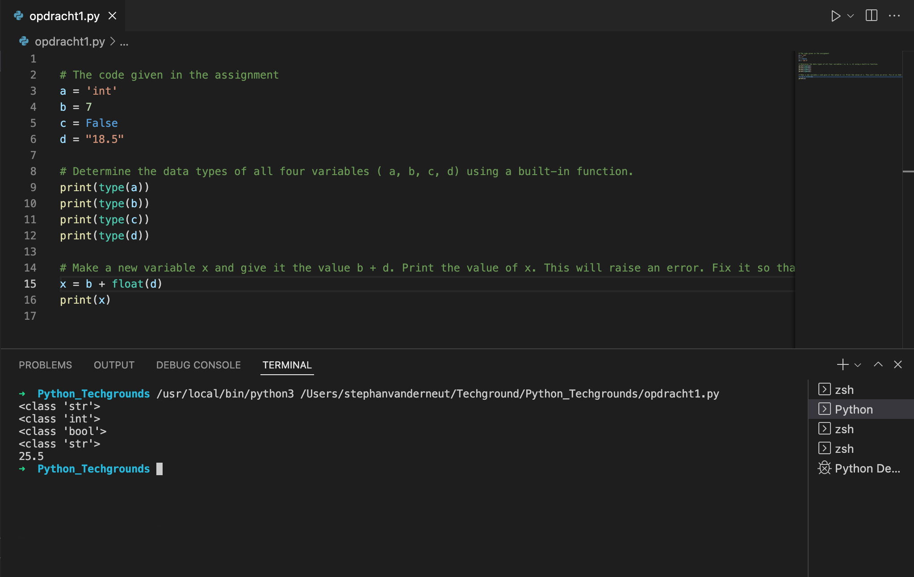
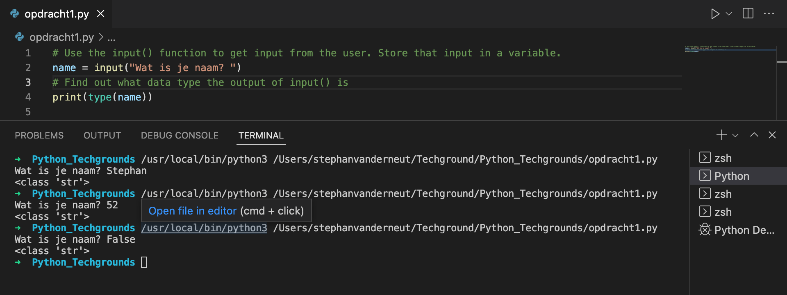

# Data Types and Comments

## Key-terms
- Boolean
- String
- Int
- Float
---
## Opdrachten

> ### Exercise 1
>- Create a new script.
>- Copy the code below into your script.
>
>a = 'int'
>
>b = 7
>
>c = False
>
>d = "18.5"
>
>- Determine the data types of all four variables ( a, b, c, d) using a built-in function.
>- Make a new variable x and give it the value b + d. Print the value of x. This will raise an error. Fix it so that print(x) prints a float.
>- Write a comment above every line of code that tells the reader what is going on in your script.
>
> ### Exercise 2
>
>- Create a new script.
>- Use the input() function to get input from the user. Store that input in a variable.
>- Find out what data type the output of input() is. See if it is different for different kinds of input (numbers, words, etc.)

---

## Bestudeer
---

### Bronnen

[London App Brewery](https://www.youtube.com/watch?v=47ujebGLMKo) - The Python Input Function

---

### Ervaren Problemen

Er zijn geen problemen geweest bij dit onderdeel.

---
## Resultaat

### Exercise 1

hier heb ik de type()function gebruikt om te achterhalen wat voor type waarden het zijn. 

Hier is de input()function gebruikt om de input op te slaan en te achtehalen wat voor type de output is. De output is op deze manier altijd een string.

