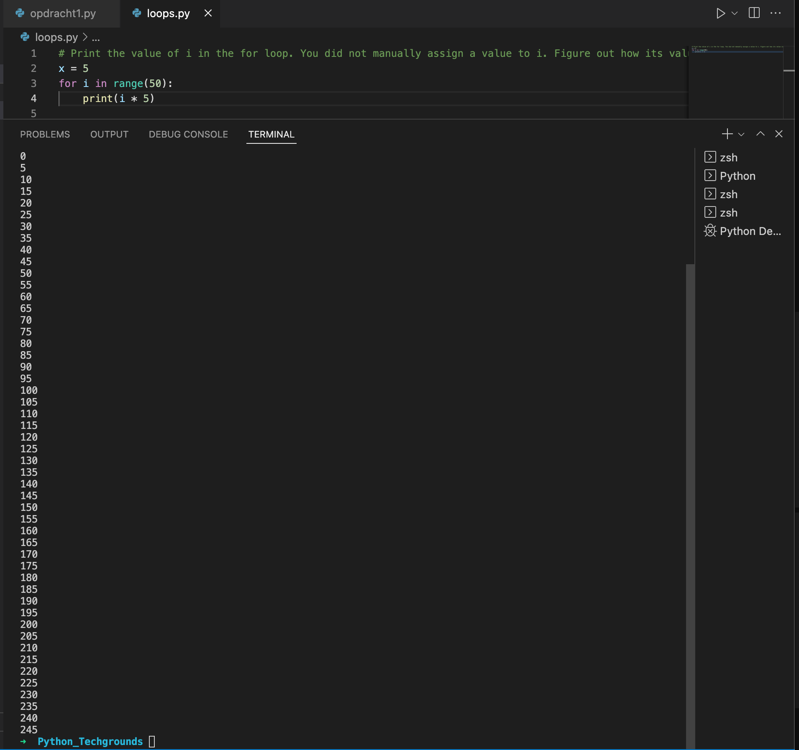

# Loops

## Key-terms
- While
- For
- Range
---
## Opdrachten
> ### Exercise 1
>- Create a new script.
>- Create a variable x and give it the value 0.
>- Use a while loop to print the value of x in every iteration of the loop. After printing, the value of x should increase by 1. The loop should run as long as x is smaller than or equal to 10.Example output:
>
> ### Exercise 2
>- Create a new script.
>- Copy the code below into your script.
>
> for i in range(10):
> 
> " # do something here
>
>- Print the value of i in the for loop. You did not manually assign a value to i. Figure out how its value is determined.
>- Add a variable x with value 5 at the top of your script.
>- Using the for loop, print the value of x multiplied by the value of i, for up to 50 iterations.
> ### Exercise 3
>- Create a new script.
>- Copy the array below into your script.
>
>arr = ["Shikha", "Casper", "Bart", "Ruben", "Ulviye"]
>
>- Use a for loop to loop over the array. Print every name individually.
>
>Example output:
>

---

## Bestudeer
---

### Bronnen

[Ioflood.com](https://ioflood.com/blog/python-increment-by-1-quick-and-easy-examples/) - Python Increment By 1 | Quick and Easy Examples

[Programiz.com](https://www.programiz.com/python-programming/for-loop) - Python for Loop

[W3Schools.com](https://www.w3schools.com/python/gloss_python_array_loop.asp) - Python Loop Through an Array

---

### Ervaren Problemen

Er zijn geen problemen geweest bij dit onderdeel.

---
## Resultaat

### Exercise 1
Hier is een loop aangemaakt met de While functie tot met nummer 10.

### Exercise 2

Hier is de "i" waarde geprint

Hier is de "x" toegevoegd en vermenigvuldigd met "i" in een range van 50

### Exercise 3

Bij deze opdracht zijn de namen individueel geprint.

