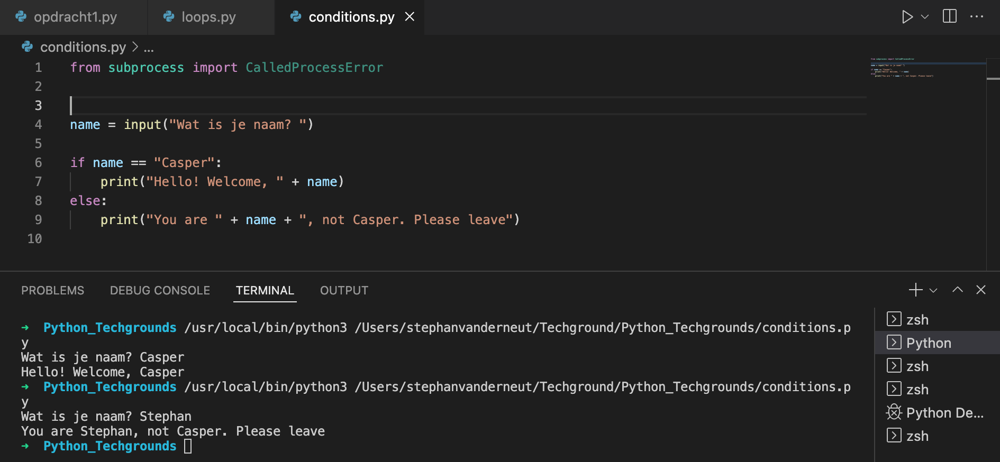

# Conditions

## Key-terms
- If
- Elif
- Else
  
---
## Opdrachten
> ### Exercise 1
>- Create a new script.
>- ExUse the input() function to ask the user of your script for their name. If the name they input is your name, print a personalized welcome message. If not, print a different personalized message.
Example output:
>
>
> ### Exercise 2
>- Create a new script.
>- Ask the user of your script for a number. Give them a response based on whether the number is higher than, lower than, or equal to 100.
Example output:
>
> Make the game repeat until the user inputs 100.
---

## Bestudeer
---

### Bronnen

[Programiz.com](https://www.programiz.com/python-programming/if-elif-else) - Python if...else Statement

[Geeksforgeeks.com](https://www.geeksforgeeks.org/how-to-take-integer-input-in-python/) - How to take integer input in Python?

---

### Ervaren Problemen

Er zijn geen problemen geweest bij dit onderdeel.

---
## Resultaat

Hier is de code aangemaakt waarbij er als er bij de input "Casper" wordt ingevoerd dat het volgende verschijnt "Hello! Welcome Casper", als er iets anders wordt ingevoerd verschijnt er "You are 'INGEVOERDE NAAM', not Casper, Please Leave".

Hier is een code aangemaakt waarbij je nummers kan invoeren. Als je een nummer onder de 100 invult staat er "'INGVOERDE NUMMER' is pretty low, isn't it'". Bij een nummer boven de 100 staat er "Wow 'INGVOERDE NUMMER' is a big number". En bij 100 staat er "'INGVOERDE NUMMER' is a big number" en dan stopt het invullen van nummers.

