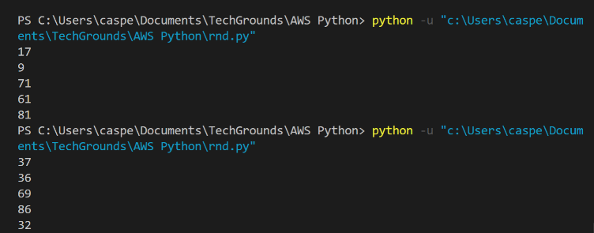
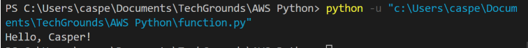
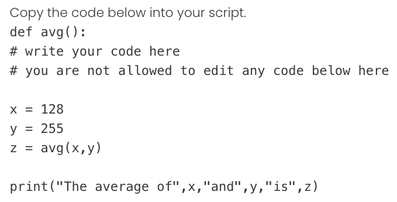
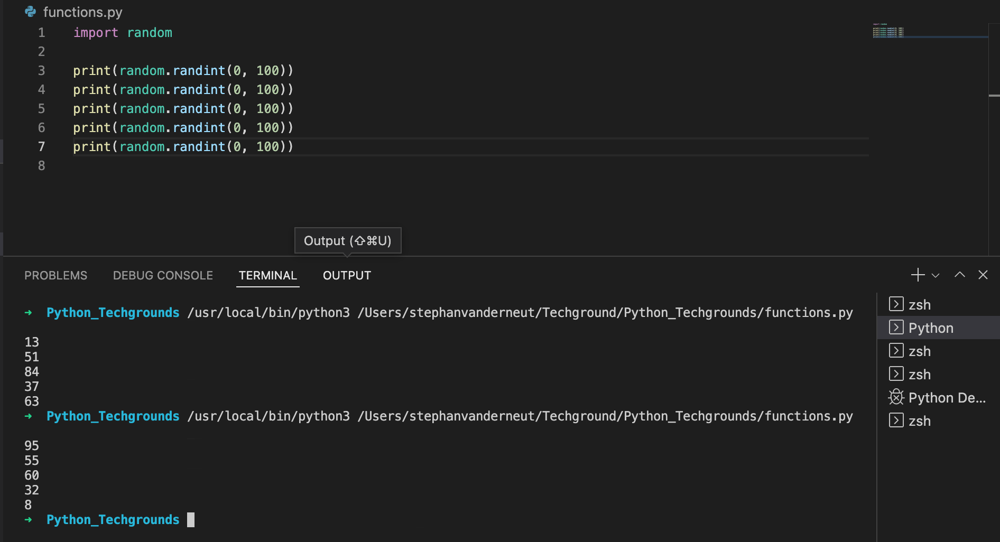
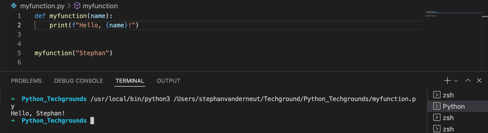
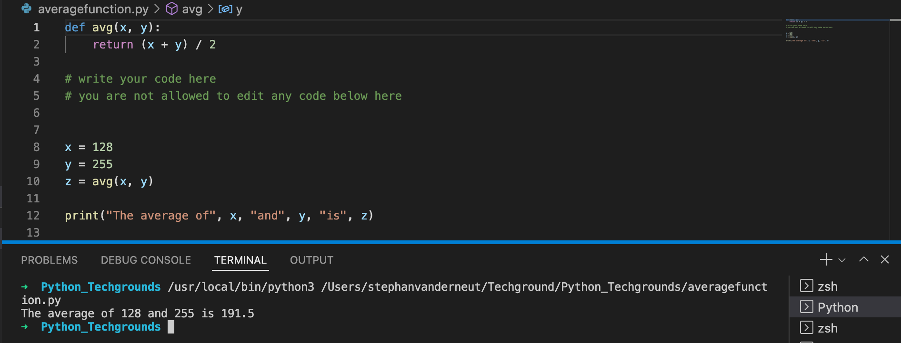

# Functions

## Key-terms
---
## Opdrachten
> ### Exercise 1
>- Create a new script.
>- Import the random package.
>- Print 5 random integers with a value between 0 and 100.
Example output:

>
> ### Exercise 2
>- Create a new script.
>- Write a custom function myfunction() that prints “Hello, world!” to the terminal. Call myfunction.
>- Rewrite your function so that it takes a string as an argument. Then, it should print “Hello, NAME!”.
Example output:
>
>
> ### Exercise 3
>- Create a new script.
>
>
>- Write the custom function avg() so that it returns the average of the given parameters. You are not allowed to edit any code below the second comment.
>

---

## Bestudeer
---

### Bronnen

[Bro Code](https://www.youtube.com/watch?v=89cGQjB5R4M) - Functions in Python are easy 📞

[Geek Tutorials](https://www.youtube.com/watch?v=RbqO9U3oH8c) - Python - Calculating Averages Tutorial

---

### Ervaren Problemen

Er zijn geen problemen geweest bij dit onderdeel.

---
## Resultaat

Hier is een code gemaakt voor 5 willekeurige nummers.

Hier is een function gemaakt.

Hier is een function gemaakt om het gemiddelde te berekenen.

