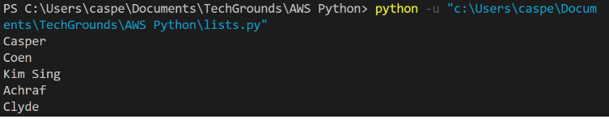
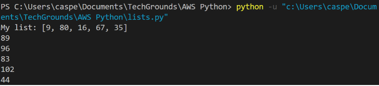
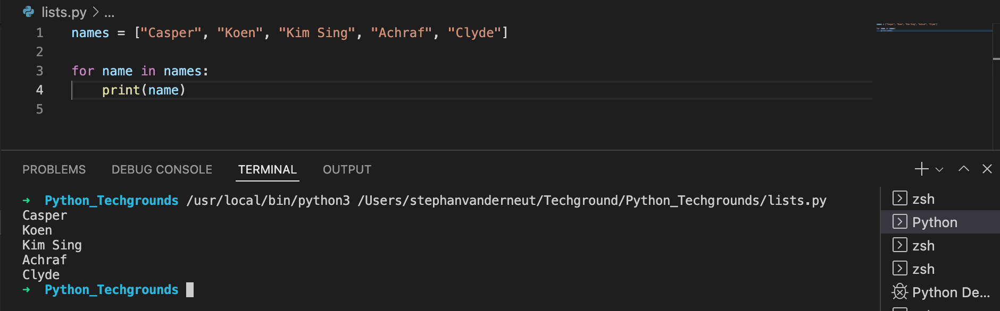
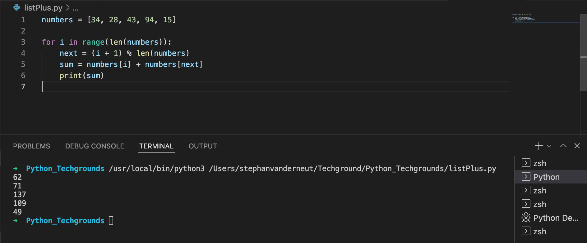

# Lists

## Key-terms
- Brackets
- index
---
## Opdrachten

> ### Excercise 1
>- Create a new script.
>- Create a variable that contains a list of five names.
>-Loop over the list using a for loop. Print every individual name in the list on a new line.
Example output:
>
>
> ### Exercise 2
>- Create a new script.
>- Create a list of five integers.
>- Use a for loop to do the following for every item in the list:
>   - Print the value of that item added to the value of the next item in the list.
>    - If it is the last item, add it to the value of the first item instead (since there is no next item).
> 
>Example output:
>
>
>
> The first result above is created by adding 9 and 80. The second result is created by adding 80 and 16, etc. The last result is created by adding 35 and 9.
---

## Bestudeer
---

### Bronnen

[Dummies.com](https://www.dummies.com/article/technology/programming-web-design/python/how-to-define-and-use-python-lists-264919/) - How to Define and Use Python Lists 

---

### Ervaren Problemen

Er zijn geen problemen geweest bij dit onderdeel.

---
## Resultaat

