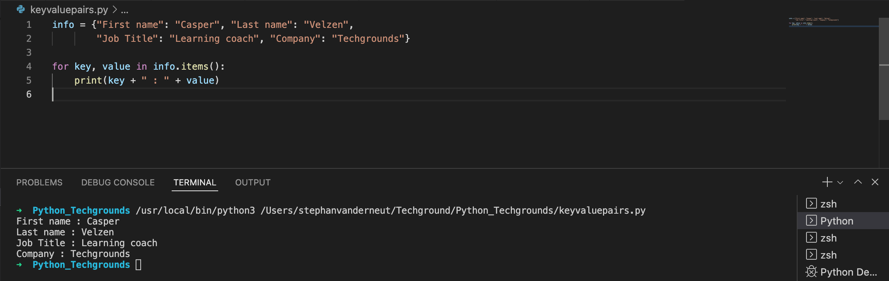
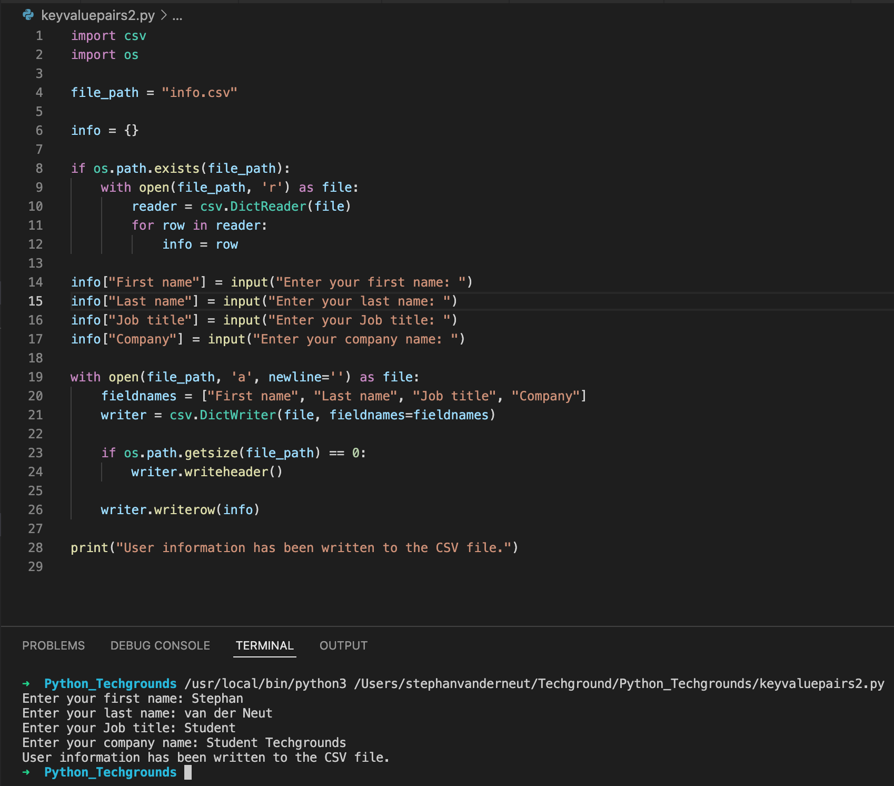

# Key-value pairs

## Key-terms
- Dictionaries (dict)
- 
---
## Opdrachten
> ### Exercise 1
>- Create a new script.
>- Create a dictionary with the following keys and values:
> 
>- Loop over the dictionary and print every key-value pair in the terminal.
>
> ### Exercise 2
>- Create a new script.
>- Use user input to ask for their information (first name, last name, job title, company). Store the information in a dictionary.
>- Write the information to a csv file (comma-separated values). The data should not be overwritten when you run the script multiple times.
>
---

## Bestudeer
---

### Bronnen

[Corey Schafer](https://www.youtube.com/watch?v=daefaLgNkw0) - Python Tutorial for Beginners 5: Dictionaries - Working with Key-Value Pairs

---

### Ervaren Problemen

---
## Resultaat

### Exercise 1

### Exercise 2

