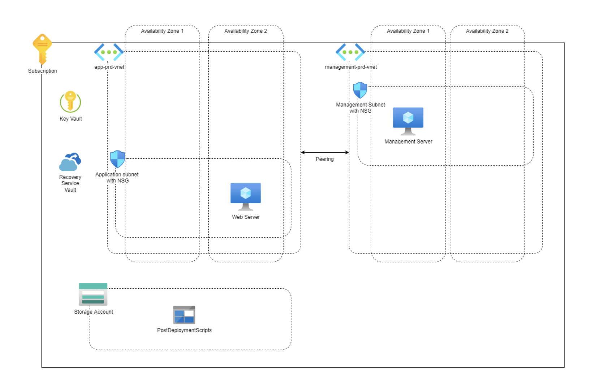

# Requirements

## list of requirements
1. All VM disks must be encrypted.
2. The web server must be backed up daily. The backups must be retained for 7 days.
3. The web server must be installed in an automated manner.
4. The admin/management server must be reachable with a public IP.
5. The admin/management server must only be accessible from trusted locations (office/admin's home)
6. The following IP ranges are used: 10.10.10.0/24 & 10.20.20.0/24
7. All subnets must be protected by a firewall at subnet level.
8. SSH or RDP connections to the web server may only be made from the admin server.

---

## Project Design
- Subscription
- Key Vault
- Recovery Service Vault  
- Storage account
- Peering (between App-prd-vnet & Management-prd-vnet )
  
**Virtual network: App-prd-vnet**
- Availability zone 2
- Subnet: 10.20.20.0/24
- Network Security Group (NSG)
- Web Server
- Public IP adres
- Network Interface card (NIC)

**Virtual Network: Management-prd-vnet**
- Availability zone 1
- Subnet: 10.10.10.0/24
- Network Security Group (NSG)
- Management Server
- Public IP adres
- Network Interface card (NIC)
- Azure Bastion

## Product Owner meeting requirements
- Project in the closest region
- Cheapest size VM's
- VM's active the whole time
- No Plan for disaster recovery, it will not affect them.
- Storage in LRS for development period
  
## Scrum Master Meeting requirements
- RPO of 1 hour, RTO of 24 hours
- Webserver can be on Linux or Windows, Adminserver needs to be on Windows.
- SQL server for the web server
  

Techground7456
!AzureProject2908Techgrounds!