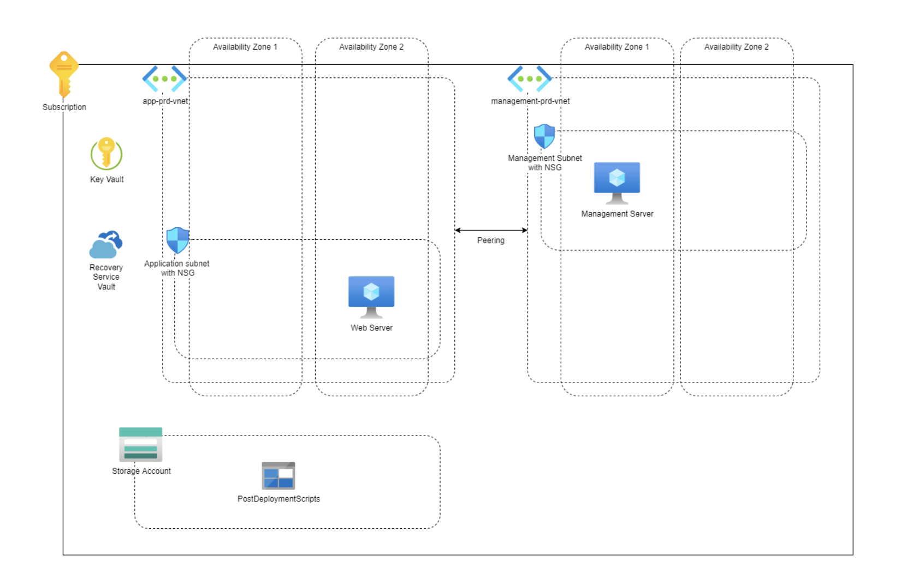

# List

- 1 subscription
- Key Vault
- Recovery Service Vault
- 2 virtual networks
  - 2 subnets
  - 2 NSG
  - Network Peering
- 2 VMs in seperate availability zones
  - Web Server
  - Managment Server
  - 2 Public IP Adresses
  - 2 VM NIC's
- Storage account

